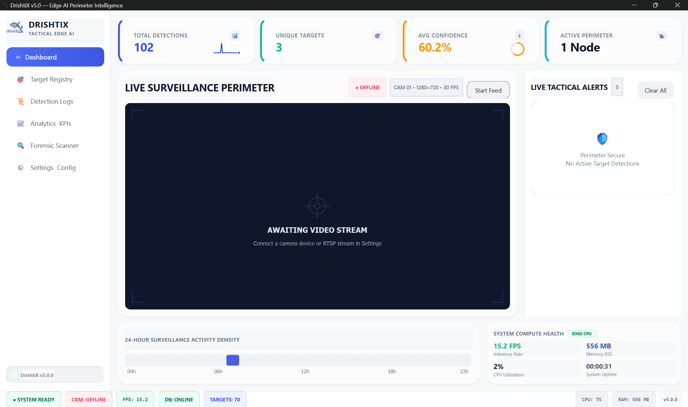
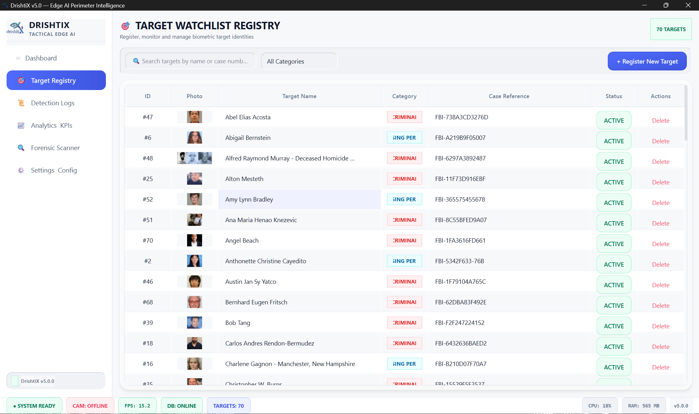
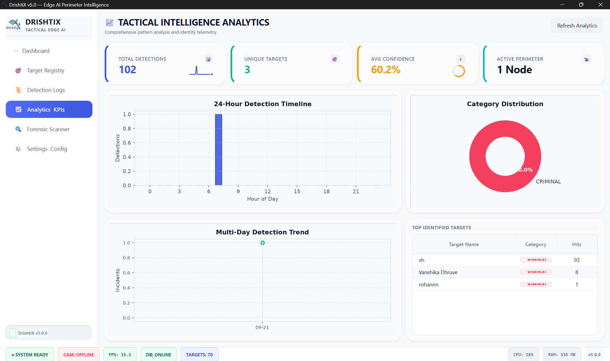
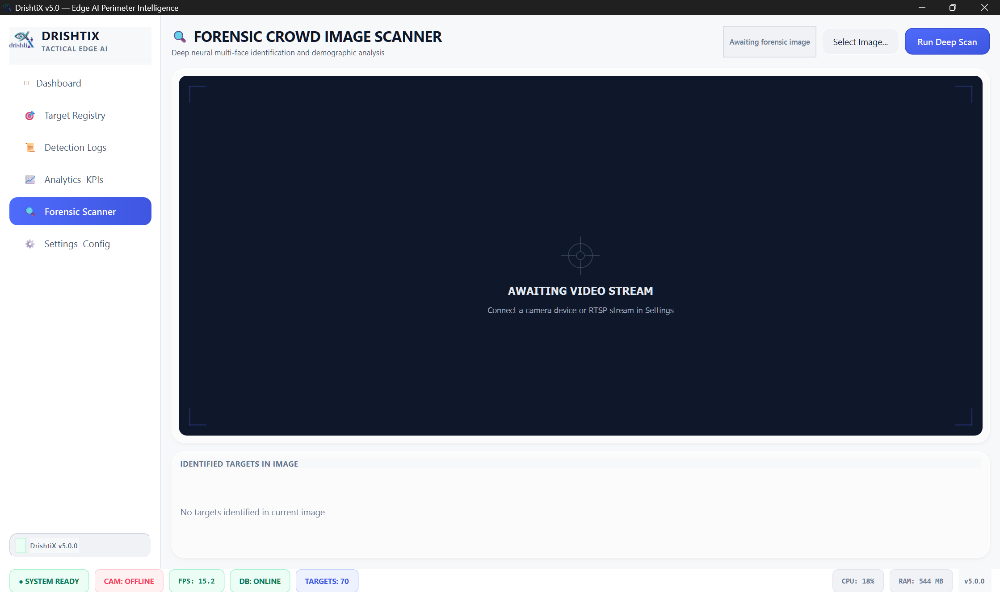
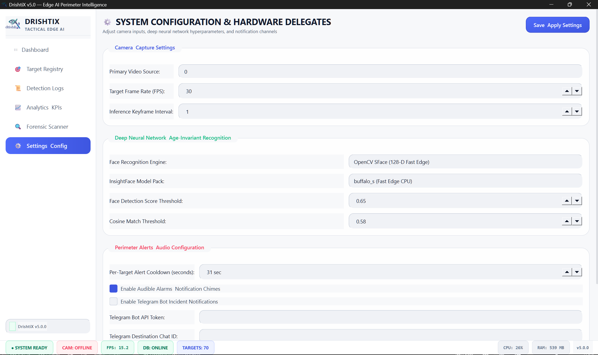
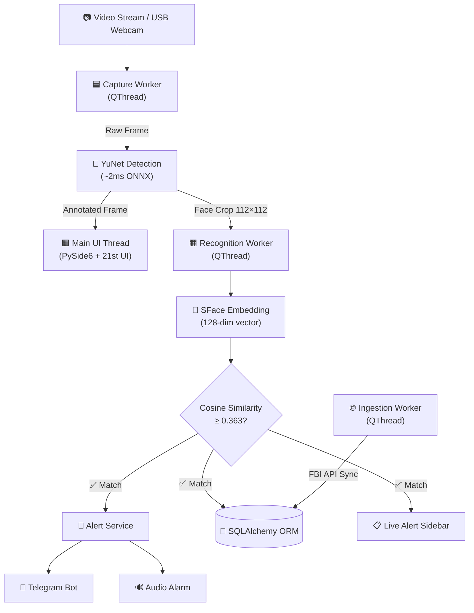
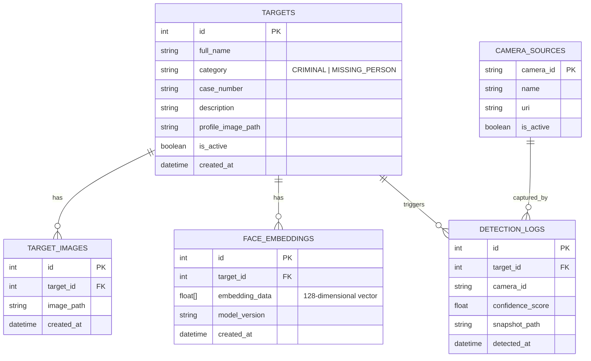

<div align="center">
  

  # DrishtiX v5.0

  ### ⚡ Edge AI Tactical Facial Recognition & Perimeter Intelligence

  [](https://www.python.org/)
  [](https://pypi.org/project/PySide6/)
  [](https://opencv.org/)
  [](https://www.sqlalchemy.org/)
  []()
  [](LICENSE)
  [](https://drive.google.com/drive/folders/15jWJ4Uz9eRBjYTOT5l0MzCCJr_kVqbDv?usp=sharing)

  *Sub-second facial identification • Automated watchlist sync • Multi-channel tactical alerts • 21st.dev UI*

  ---

  [**Features**](#-features) · [**Screenshots**](#-screenshots) · [**Quick Start**](#-quick-start) · [**Architecture**](#-architecture) · [**Tech Stack**](#-tech-stack) · [**Documentation & Drive**](#-documentation--project-drive) · [**Team**](#-team)

</div>

---

## 🎯 What is DrishtiX?

**DrishtiX** transforms standard video feeds into proactive, automated security perimeters. It deploys deep neural networks directly at the edge — running **YuNet** face detection and **SFace** 128-dimensional embedding extraction — to cross-reference live camera streams against local target registries and external law enforcement databases in real-time.

> **🔑 Key differentiator:** Zero-cloud dependency. All inference runs locally on commodity hardware. No frames leave your network.

<div align="center">

| Metric | Performance |
|:---|:---|
| 🧠 Face Detection Latency | **~2ms** (YuNet ONNX) |
| 📐 Embedding Extraction | **128-D SFace** vectors |
| 🎯 Match Threshold | Cosine similarity ≥ 0.363 |
| 🧪 Test Coverage | **59/59 tests passing** |
| 🖥️ UI Framework | PySide6 + 21st.dev Design System |

</div>

---

## ✨ Features

<table>
<tr>
<td width="50%">

### 🔴 Real-Time Edge AI
- Sub-millisecond face localization with **YuNet ONNX**
- 128-D age-invariant **SFace** embedding vectors
- In-memory vectorized cosine similarity gallery search
- Configurable match thresholds per deployment

</td>
<td width="50%">

### 🛡️ Tactical Alerting
- **Telegram Bot** push notifications with forensic snapshots
- Audible alarm chimes with configurable cooldowns
- Live sidebar alert queue with 50-card memory pruning
- Glassmorphic alert cards with biometric metadata

</td>
</tr>
<tr>
<td>

### 📊 Intelligence Analytics
- 24-hour detection timeline bar charts
- Category breakdown donut visualization
- Multi-day trend analysis with sparklines
- Top identified targets leaderboard
- KPI cards with animated counters

</td>
<td>

### 🔍 Forensic Scanner
- Batch scan crowd photos for watchlist matches
- Multi-face detection (40+ faces per image)
- Demographic estimation (age & gender)
- Annotated output with tactical bounding boxes

</td>
</tr>
<tr>
<td>

### 🌐 Automated Ingestion
- Scheduled FBI Wanted API background sync
- Zero-FPS-impact asynchronous polling
- Automatic profile photo + embedding extraction
- Deduplication via case number matching

</td>
<td>

### 🎨 21st.dev UI Design System
- Custom SVG vector icon system (Lucide/21st style)
- Animated sliding navigation pill indicator
- Cross-fade view transitions (220ms OutCubic)
- Live radar breathing status dots
- Interactive card hover elevation & glow

</td>
</tr>
</table>

---

## 📸 Screenshots

<div align="center">

### Tactical Command Dashboard
*Real-time KPI metrics, live video feed, system health telemetry, and 24-hour activity heatmap*



---

### Target Watchlist Registry
*Biometric identity management with FBI case references, category badges, and inline photo previews*



---

### Intelligence Analytics Dashboard
*Hourly detection timelines, category distribution, multi-day trends, and top target rankings*



---

### Forensic Crowd Image Scanner
*Deep neural multi-face identification with demographic analysis on static imagery*



---

### System Configuration
*Camera inputs, DNN hyperparameters, alert channels, and database diagnostics*



</div>

---

## 🚀 Quick Start

### Prerequisites

| Requirement | Version |
|:---|:---|
| Python | 3.11+ |
| Camera | USB webcam or RTSP stream |
| OS | Windows 10/11, Linux, macOS |

### One-Click Launch (Windows)

```cmd
git clone https://github.com/sachinxrg/DrishtiX.git
cd DrishtiX
start_drishtix_py.bat
```

> The launcher automatically provisions the virtual environment, installs all dependencies, downloads ONNX models, and boots the application.

### Manual Setup

```bash
# Clone & navigate
git clone https://github.com/sachinxrg/DrishtiX.git
cd DrishtiX/services/drishtix-py

# Create virtual environment
python -m venv venv

# Activate (Windows)
venv\Scripts\activate

# Activate (Linux/macOS)
# source venv/bin/activate

# Install dependencies
pip install -r requirements.txt

# Launch DrishtiX
python main.py
```

### Running Tests

```bash
cd services/drishtix-py

# Run full test suite (59 tests)
venv\Scripts\pytest.exe tests/ -v

# Quick summary
venv\Scripts\pytest.exe tests/ -q
```

```
...........................................................  [100%]
59 passed in 12.28s
```

---

## 🏗️ Architecture

### 5-Tier Concurrency Pipeline



### Entity-Relationship Model



### Project Structure

```
DrishtiX/
├── services/drishtix-py/           # Primary Python Edge AI Application
│   ├── drishtix/                   # Core source package
│   │   ├── core/                   # Config, constants, signals, feature flags
│   │   ├── dao/                    # SQLAlchemy session & data access layer
│   │   ├── models/                 # ORM schemas (Target, DetectionLog, Camera)
│   │   ├── services/               # Business logic (Detection, Recognition, Alerts)
│   │   ├── ui/                     # PySide6 GUI + 21st.dev design system
│   │   │   ├── icons.py            # SVG vector icon renderer (Lucide paths)
│   │   │   ├── motion.py           # Animations: fading, pulsing, sliding pill
│   │   │   ├── theme_tokens.py     # Design tokens: colors, spacing, elevation
│   │   │   ├── views/              # Dashboard, Registry, Logs, Analytics, Scanner, Settings
│   │   │   └── widgets/            # GlassCard, KPICard, NavButton, AlertSidebar, etc.
│   │   ├── utils/                  # Vector math, model downloader, audio
│   │   └── workers/                # QThread workers (Capture, Recognition, Ingestion)
│   ├── tests/                      # Pytest test suite (59 tests)
│   ├── tools/                      # QSS generator, development utilities
│   ├── config.yaml                 # Runtime configuration
│   ├── main.py                     # Application entry point
│   └── requirements.txt            # Python dependencies
├── docs/                           # Screenshots & project documentation
├── start_drishtix_py.bat           # One-click Windows launcher
└── stop_drishtix_py.bat            # Graceful shutdown script
```

---

## 🛠️ Tech Stack

<div align="center">

| Layer | Technology |
|:---|:---|
| **Language** | Python 3.11+ |
| **GUI** | PySide6 (Qt6) + 21st.dev glassmorphic design system |
| **Computer Vision** | OpenCV DNN 4.9+, ONNX Runtime |
| **Face Detection** | YuNet (real-time, ~2ms per frame) |
| **Face Recognition** | SFace (128-D embeddings, cosine similarity) |
| **ORM & Persistence** | SQLAlchemy 2.0+ with SQLite (WAL mode) |
| **Validation** | Pydantic v2 |
| **Async Networking** | HTTPX (FBI API ingestion) |
| **Charting** | Matplotlib + NumPy |
| **Testing** | Pytest (59 tests across DAO, UI, vectors, analytics) |
| **Notifications** | Telegram Bot API |

</div>

---

## 📖 Usage Guide

<details>
<summary><b>1. 🎯 Enrolling Targets</b></summary>

Navigate to **Target Registry** → Click **+ Register New Target** → Enter name, category (Criminal/Missing Person), case reference → Upload a reference photo. DrishtiX automatically extracts and stores the 128-D facial embedding.

</details>

<details>
<summary><b>2. 📹 Live Monitoring</b></summary>

Switch to the **Dashboard** → Click **Start Feed** to activate the camera pipeline. Recognized targets trigger bounding box overlays, audible chimes, Telegram notifications, and sidebar alert cards — all simultaneously.

</details>

<details>
<summary><b>3. 🔍 Forensic Scanning</b></summary>

Navigate to **Forensic Scanner** → Select a crowd image → Click **Run Deep Scan**. DrishtiX identifies all faces, cross-references against the enrolled database, and annotates matches with confidence scores and demographics.

</details>

<details>
<summary><b>4. 📊 Analytics & Reporting</b></summary>

The **Analytics** view provides hourly detection timelines, category distribution donut charts, multi-day trend lines, and a top identified targets ranking. Export CSV audit logs for formal reporting.

</details>

<details>
<summary><b>5. ⚙️ Configuration</b></summary>

The **Settings** view allows tuning camera sources, DNN thresholds, recognition engine selection (SFace/ArcFace), alert cooldowns, Telegram bot credentials, and database diagnostics.

</details>

---

## 🗺️ Roadmap

- [x] Python-centric architecture migration (PySide6 + OpenCV ONNX)
- [x] Multi-threaded decoupled producer-consumer inference pipeline
- [x] Automated FBI Wanted API background ingestion
- [x] Multi-channel tactical alerting (Telegram + Audio)
- [x] 21st.dev UI design system with SVG vector icons & fluid animations
- [x] Animated sliding navigation pill indicator (Framer Motion style)
- [x] Interactive card hover elevation with border glow
- [x] Comprehensive test suite (59 automated tests)
- [ ] Multi-camera RTSP stream grid multiplexer
- [ ] Deep SORT / ByteTrack cross-camera re-identification
- [ ] Edge Docker containerization (`docker-compose`)

---

## 📁 Documentation & Project Drive

All consolidated master documentation & video recordings are archived and accessible via Google Drive:

<div align="center">

[](https://drive.google.com/drive/folders/15jWJ4Uz9eRBjYTOT5l0MzCCJr_kVqbDv?usp=sharing)

**Direct Google Drive URL:**  
[`https://drive.google.com/drive/folders/15jWJ4Uz9eRBjYTOT5l0MzCCJr_kVqbDv?usp=sharing`](https://drive.google.com/drive/folders/15jWJ4Uz9eRBjYTOT5l0MzCCJr_kVqbDv?usp=sharing)

</div>

### 📑 What's Inside the Drive:
- 📘 **Master Comprehensive Project Report (`DX-MST`)**: Full consolidated Word document (`DrishtiX_Master_Project_Report.docx`) and complete academic dissertation.
- 📚 **Individual Documentation Suite (PDF & DOCX)**:
  - `DX-SDD`: System Design Document (5-Tier Architecture, UML Suite, DFDs, Data Dictionary, DPDP Act 2023 compliance, 22 ADRs)
  - `DX-BED`: Backend Specification (16 business services, 7 DAOs, 8 ORM models, 4 background workers, AI/CV pipeline)
  - `DX-FED`: Frontend Specification (2-tier token system, 917-line glassmorphic QSS, 21 custom widgets, screen walkthrough)
  - `DX-TST`: SQA & Testing Document (59 automated test cases, defect logs BUG-01 to BUG-05, latency benchmarks)
  - `DX-EVD`: Engineering Evidence Pack (Sprint logs, Jira epics, velocity charts, 51 Git commits, CodeRabbit reviews)
  - `DX-FPR`: Final Project Report & Academic Dissertation (Literature survey, version evolution v1.0–v5.0, 22-question viva defense script)
- 🖼️ **Visual Assets & Snapshots**: High-resolution UI screenshots (`Dashboard.png`, `Target_Registry.png`, `Forensic_Scanner.png`, `Analytics_KPIs.png`, `Settings_Config.png`) and architectural diagrams.
- 🎥 **Demonstration Media**: Screen recordings of live face detection, Telegram push alerts, and batch forensic scans.

---

## 👥 Team

| Role | Name |
|:---|:---|
| 🎯 **Project Manager** | Sachidanand Gond |
| 🏗️ **System Designer** | Arjun Prajapati |
| 🧪 **Tester / QA** | Rohan Mallah |
| 💻 **Developer** | Tejas Gohil |
| 🚀 **Deployer** | Amos Raj Kennedy |

---

## 🤝 Contributing

1. Fork the project
2. Create your feature branch (`git checkout -b feature/AmazingFeature`)
3. Commit using [Conventional Commits](https://www.conventionalcommits.org/) (`git commit -m 'feat(core): add feature'`)
4. Push to your branch (`git push origin feature/AmazingFeature`)
5. Open a Pull Request

---

## 📄 License

Distributed under the **MIT License**.

**Repository:** [github.com/sachinxrg/DrishtiX](https://github.com/sachinxrg/DrishtiX)

<div align="center">
  <br/>
  <sub>Engineered with precision for tactical edge surveillance operations.</sub>
  <br/><br/>
  
</div>
