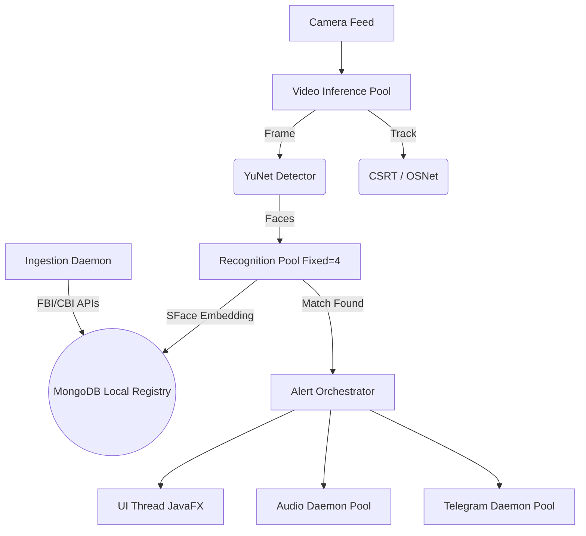

<div align="center">
  

  # DrishtiX 
  **Advanced Edge-AI Facial Recognition & Surveillance Ecosystem**

  [](https://adoptium.net/)
  [](https://openjfx.io/)
  [](https://opencv.org/)
  [](https://www.mongodb.com/)
  []()
  []()

  *Next-Generation Real-Time Anomaly Detection, Criminal Identification, and Automated Alerting.*

</div>

---

## 📖 Overview

**DrishtiX** is an enterprise-grade smart surveillance application built to redefine real-time identification. Leveraging deep learning computer vision via OpenCV (YuNet/SFace), DrishtiX operates directly at the edge to instantly cross-reference live video feeds against registered databases of missing persons and high-value targets. 

Unlike traditional passive surveillance, DrishtiX is **proactive**. With unified telemetric dashboards, automated background ingestion of global databases (FBI, CBI), and multi-channel instant alerting (Telegram, Desktop Toasts, Audio), it turns ordinary camera feeds into intelligent, actionable security perimeters.

---

## ✨ System Highlights

### 🧠 Core AI & Computer Vision
- **YuNet Face Detection:** Ultra-fast, lightweight face detection optimized for edge computing (~2-5ms per frame).
- **SFace Recognition:** Extracts 128-dimensional facial embeddings for high-accuracy cosine similarity matching against registered targets.
- **Persistent Body Re-ID & CSRT Tracking:** Facial-to-spatial handoff. Once a face is identified, DrishtiX uses OSNet whole-body embeddings and CSRT tracking to maintain bounding boxes even if the target turns away or becomes partially occluded.

### 🌐 Automated Global Intelligence
- **Background Ingestion Engine:** Configurable background daemons scrape and synchronize data from external sources.
- **FBI Wanted API Integration:** Authenticates and pulls latest wanted lists directly from the FBI API, complete with facial images and case descriptions.
- **CBI & TrackChild Support:** Expanding support for domestic missing children and criminal databases for automated local registry injections.

### 🔔 Multi-Channel Alert Dispatch
- **Telegram Field Alerts:** Asynchronous, fire-and-forget push notifications to field officers via the Telegram Bot API, complete with captured snapshot frames, case numbers, and confidence scores.
- **Desktop Toasts:** Non-blocking JavaFX/ControlsFX toast notifications for the system operator.
- **Audible Alarms:** Trigger-based audio sirens to immediately alert local security personnel.

### 💎 Premium Ambient UI Architecture
- **Ambient Glassmorphism Bento Grid:** A completely bespoke, light-themed, modern UI architecture (v4.0). Simulates physical glass panels floating over ambient, responsive backdrops utilizing strict proprietary `-fx-` CSS.
- **Real-Time Telemetry:** Live FPS monitoring, active camera detection, and rolling alert logs without sacrificing main thread performance.

---

## 🏗️ Technical Architecture

DrishtiX maintains zero UI latency by strictly isolating heavy computational workloads across a highly concurrent threading model:



---

## 🛠️ Technology Stack

| Component | Technology | Description |
|-----------|------------|-------------|
| **Language** | Java 17+ | Core robust backend logic |
| **UI Framework** | JavaFX 21.0.2 | Hardware-accelerated GUI rendering |
| **Computer Vision** | OpenCV 4.9.0 | JavaCV wrappers for YuNet, SFace, OSNet |
| **Database** | MongoDB 6.0+ | Document-based target and configuration registry |
| **Network/REST** | Java 11 `HttpClient` | Asynchronous, non-blocking external API calls |
| **Logging** | SLF4J + Logback | Asynchronous rolling log files |

---

## 🚀 Getting Started

### 1. Prerequisites
- **Java 17 JDK** or higher.
- **MongoDB 6.0+** running on `localhost:27017` (default).
- A connected USB Webcam or integrated laptop camera.

### 2. Database & API Configuration
Initialize your local database and configure your API keys (like the FBI API or Telegram Bot Token):

1. **MongoDB Init (Optional):** Use `database/drishtix_init.js` to pre-populate required collections.
2. **Configuration:** Copy `services/drishtix-app/config.properties.example` to `config.properties` and update it with your DB URI, Telegram Bot Token, Chat ID, and FBI API Key.

### 3. Build & Run
DrishtiX uses the Maven Wrapper, ensuring you don't need a global Maven installation.

```powershell
# Navigate to the app directory
cd services/drishtix-app

# Clean and package the Fat JAR
.\mvnw.cmd clean package

# Run the system
java -jar target/drishtix-app-2.0.0-SNAPSHOT.jar
```

---

## 📖 Operational Guide

1. **System Initialization:** On boot, the system validates models and database connections. The ingestion engine will start fetching FBI data after a 60-second stabilization delay.
2. **Registration:** Use the **Target Index** panel to manually upload high-quality, frontal images of targets.
3. **Configuration:** Use the **Settings** panel to adjust confidence thresholds, cooldown intervals, and API integrations.
4. **Active Surveillance:** Click the circular action button on the **Dashboard** to engage the camera. The system will autonomously scan, track, and alert.

---

## 📜 License
This project is proprietary and confidential. Unauthorized copying, distribution, or reverse engineering of this repository's contents, via any medium, is strictly prohibited.

---
<div align="center">
  <i>Developed with precision for advanced security ecosystems.</i>
</div>
