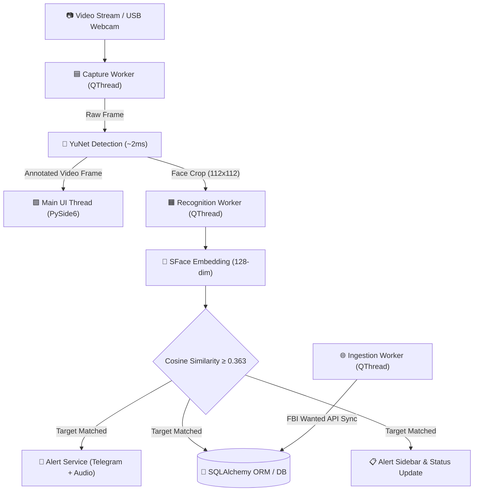
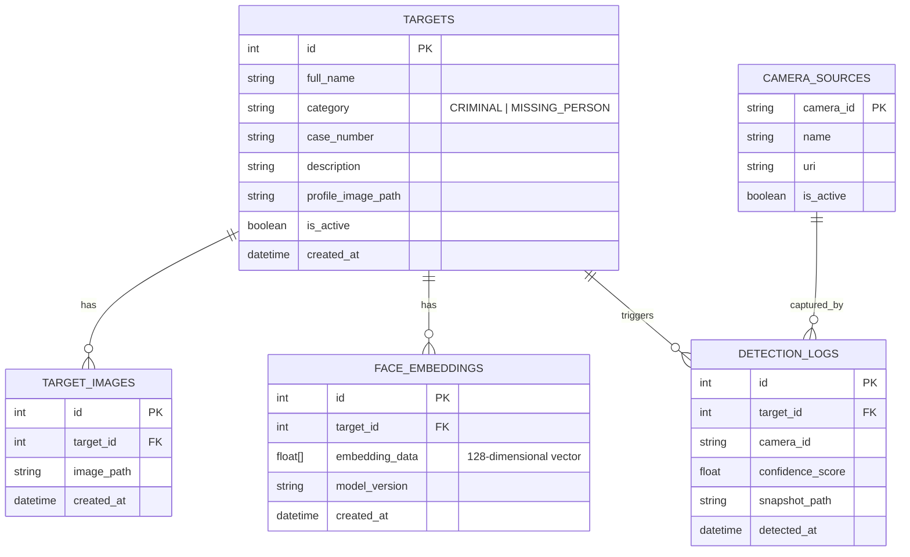

<div align="center">
  

  # DrishtiX 
  **Next-Generation Edge-AI Tactical Facial Recognition & Surveillance Ecosystem**

  [](https://www.python.org/)
  [](https://pypi.org/project/PySide6/)
  [](https://opencv.org/)
  [](https://www.sqlalchemy.org/)
  []()
  []()

  *Real-Time Edge AI Detection, Cross-Camera Identification, Automated Target Ingestion, and Multi-Channel Tactical Alerting.*
</div>

---

## 📑 Table of Contents
- [About the Project](#-about-the-project)
- [Key Capabilities](#-key-capabilities)
- [Repository Directory Structure](#-repository-directory-structure)
- [Tech Stack & Architecture](#-tech-stack--architecture)
  - [Python Stack (`drishtix-py` — Active)](#1-python-stack-drishtix-py--active)
  - [Legacy Java Stack (`drishtix-app` — Reference)](#2-legacy-java-stack-drishtix-app--reference)
  - [5-Tier Concurrency Pipeline](#3-5-tier-concurrency-pipeline)
  - [Entity-Relationship Model](#4-entity-relationship-model)
- [Getting Started](#-getting-started)
  - [Prerequisites](#prerequisites)
  - [Quick Start (Python Stack)](#quick-start-python-stack)
  - [Running Tests](#running-tests)
- [Usage Guide](#-usage-guide)
- [Roadmap](#-roadmap)
- [Contributing](#-contributing)
- [License & Maintainer](#-license--maintainer)

---

## 🎯 About the Project

**DrishtiX** transforms standard video feeds into proactive, automated security perimeters. Traditional surveillance setups rely on manual monitoring, leading to fatigue and missed detections. DrishtiX bridges this gap by deploying deep neural networks (YuNet face detector & SFace 128-dimensional vector embeddings) directly at the edge to cross-reference video feeds against local target registries and external intelligence feeds (including automated background ingestion of the FBI Wanted API).

Whether deployed at critical infrastructure checkpoints, transit hubs, or private facilities, DrishtiX delivers sub-second face identification, spatial tracking, and instant multi-channel tactical alerts (Telegram push notifications with forensic snapshots, audio alarms, and desktop dashboard cards).

---

## ✨ Key Capabilities

- **Real-Time Edge AI Inference:** Sub-millisecond face localization with YuNet and high-precision 128-dimensional embedding generation via SFace.
- **In-Memory Gallery Vector Search:** Vectorized cosine similarity scoring against enrolled target profiles with configurable matching thresholds.
- **Decoupled Asynchronous Workers:** Zero UI stuttering through dedicated `QThread` workers for video capture, recognition inference, and external API polling.
- **Automated External Ingestion:** Scheduled background sync with external law enforcement registries (e.g., FBI Wanted API) without degrading camera FPS.
- **Tactical Multi-Channel Alerting:** Instant push notifications via Telegram Bot API with attached high-resolution forensic snapshot frames, case IDs, and timestamps.
- **Forensic Image Scanner:** Batch scan forensic images against the enrolled watchlist to identify persons of interest from offline evidence.
- **Comprehensive Analytics & Telemetry:** Interactive Matplotlib dashboards tracking detection frequency, category breakdowns, and hardware telemetry.

---

## 📂 Repository Directory Structure

```text
DrishtiX/
├── .agents/                               # Antigravity agent workflows & development rules
│   └── workflows/                         # Automated iteration and lifecycle workflows
├── database/                              # Database schemas, seeds, and migration scripts
│   ├── drishtix_init.js                   # MongoDB legacy initialization script
│   └── schema.sql                         # SQL database schema definitions
├── docs/                                  # Comprehensive architectural and project documentation
│   ├── Chapter_1_Introduction.md          # Project introduction, scope, and objectives
│   ├── Chapter_2_Survey_of_Technologies.md# Comparative tech survey (Java vs Python, OpenCV vs Dlib)
│   ├── Chapter_3_Requirements_and_Analysis.md # Requirements, use cases, and concurrency model
│   └── DrishtiX_v3_Documentation.md       # Full architectural specification and diagrams
├── scripts/                               # Automation, test runners, and maintenance utilities
│   ├── generate_ch1_ch2.py                # Documentation build script
│   ├── generate_diagrams_docx.py          # Diagram extraction and documentation compiler
│   └── run_py_tests.bat                   # Batch runner for Python pytest test suite
├── services/                              # Application microservices & core packages
│   ├── drishtix-py/                       # Primary Python-centric edge AI application
│   │   ├── assets/                        # Static assets (sounds, notification audio)
│   │   ├── drishtix/                      # Core Python source package
│   │   │   ├── core/                      # Configuration, constants, enums, signals bus
│   │   │   ├── dao/                       # SQLAlchemy Data Access Objects & session management
│   │   │   ├── models/                    # Declarative ORM schemas (Target, Log, Camera, Audit)
│   │   │   ├── services/                  # Business logic (Detection, Recognition, Ingestion, Telegram)
│   │   │   ├── ui/                        # PySide6 desktop GUI (Views, custom widgets, dark QSS)
│   │   │   ├── utils/                     # Vector math, model downloader, audio synthesizer
│   │   │   └── workers/                   # Asynchronous QThread workers (Capture, Recognition, Ingestion)
│   │   ├── models/                        # Pretrained ONNX weights (YuNet detector & SFace recognizer)
│   │   ├── tests/                         # Pytest test suite (DAO, Vector Math, Analytics)
│   │   ├── config.yaml                    # Application runtime configuration
│   │   ├── main.py                        # Python application entry point
│   │   ├── pyproject.toml                 # PEP 517/518 build configuration
│   │   ├── requirements.txt               # Python package dependencies
│   │   └── README.md                      # Service-specific documentation
│   ├── drishtix-app/                      # Legacy Java 17 / JavaFX application (reference)
│   │   ├── src/                           # Java source code
│   │   └── pom.xml                        # Maven configuration
│   └── reid-service/                      # Legacy Python Re-ID service (now unified in drishtix-py)
├── .gitignore                             # Git hygiene, artifact, and secret exclusion rules
├── DRISHTIX logo.png                      # Project branding logo
├── pom.xml                                # Root Maven parent configuration
├── README.md                              # Main repository documentation & guide
├── start_drishtix_py.bat                  # One-click launcher for Python desktop application
└── stop_drishtix_py.bat                   # Graceful process termination script for Python runtime
```

---

## 🏗️ Tech Stack & Architecture

### 1. Python Stack (`drishtix-py` — Active)
- **Language:** Python 3.11+
- **GUI Framework:** PySide6 (Qt6) with custom dark glassmorphic styling
- **Computer Vision & AI:** OpenCV DNN 4.9.0+, ONNX Runtime (YuNet face detector, SFace 128-d recognizer)
- **Data Persistence:** SQLAlchemy 2.0+ ORM with SQLite / MySQL backends
- **Data Serialization & Validation:** Pydantic v2 & PyYAML
- **Asynchronous Networking:** HTTPX
- **Visual Analytics:** Matplotlib & NumPy
- **Testing:** Pytest & Pytest-Qt

### 2. Legacy Java Stack (`drishtix-app` — Reference)
- **Language:** Java 17 LTS
- **Build Tool:** Apache Maven
- **GUI:** JavaFX 21 & ControlsFX
- **Computer Vision:** OpenCV / JavaCV
- **Database:** MongoDB Sync Driver

### 3. 5-Tier Concurrency Pipeline



### 4. Entity-Relationship Model



---

## 🚀 Getting Started

### Prerequisites
- [Python 3.11+](https://www.python.org/downloads/) installed and added to your `PATH`.
- A connected USB Webcam or accessible RTSP camera stream.
- [Git](https://git-scm.com/) installed.

### Quick Start (Python Stack)

1. **Clone the repository:**
   ```bash
   git clone https://github.com/sachinxrg/DrishtiX.git
   cd DrishtiX
   ```

2. **Launch using the automated script (Windows):**
   ```cmd
   start_drishtix_py.bat
   ```
   *This automatically verifies the virtual environment, installs dependencies from `requirements.txt`, checks ONNX models, and boots the application.*

3. **Or run manually via terminal:**
   ```bash
   cd services/drishtix-py
   python -m venv venv
   # Windows:
   venv\Scripts\activate
   # Linux/macOS:
   source venv/bin/activate

   pip install -r requirements.txt
   python main.py
   ```

### Running Tests
Execute the automated test suite covering DAO models, vector mathematics, and analytics aggregation:
```bash
# Run via batch script
scripts\run_py_tests.bat

# Or directly with pytest
pytest services/drishtix-py/tests -v
```

---

## 📖 Usage Guide

1. **Enrolling Targets:**
   - Navigate to the **Target Registry** view.
   - Click **Add Target**, input personal details, select a category (`CRIMINAL`, `MISSING_PERSON`, etc.), and upload a reference photo.
   - DrishtiX automatically extracts and stores the 128-dimensional facial embedding in the gallery.

2. **Live Monitoring:**
   - Switch to the **Dashboard** view.
   - Click **Start Camera** to activate the video capture and detection pipeline.
   - Recognized individuals trigger a high-visibility bounding box, audible chime, Telegram push notification, and sidebar entry.

3. **Forensic Image Scan:**
   - Navigate to the **Forensic Scanner** tab.
   - Drop suspect or crowd images to perform offline recognition against the enrolled database.

4. **Analytics & Reports:**
   - Review detection patterns, hourly frequencies, and export formal law enforcement audit logs in CSV/PDF format via the **Analytics** view.

---

## 🗺️ Roadmap

- [x] Python-centric architecture migration with PySide6 & OpenCV ONNX.
- [x] Multi-threaded decoupled producer-consumer inference pipeline.
- [x] Automated FBI Wanted API background ingestion.
- [x] Multi-channel tactical alerting (Telegram bot + Audio).
- [ ] Multi-camera RTSP stream grid multiplexer.
- [ ] Deep SORT / ByteTrack integration for long-term multi-camera re-identification.
- [ ] Edge Docker containerization (`docker-compose` deployment).

---

## 🤝 Contributing

Contributions are welcome! Follow these steps to contribute:
1. Fork the project.
2. Create your feature branch (`git checkout -b feature/AmazingFeature`).
3. Commit your changes following [Conventional Commits](https://www.conventionalcommits.org/) (`git commit -m 'feat(core): add feature'`).
4. Push to your branch (`git push origin feature/AmazingFeature`).
5. Open a Pull Request.

---

## 📄 License & Maintainer

Distributed under the **MIT License**.

- **Maintainer:** Sachidanand  
- **Repository:** [https://github.com/sachinxrg/DrishtiX](https://github.com/sachinxrg/DrishtiX)

<div align="center">
  <i>Engineered with precision for tactical edge surveillance operations.</i>
</div>
