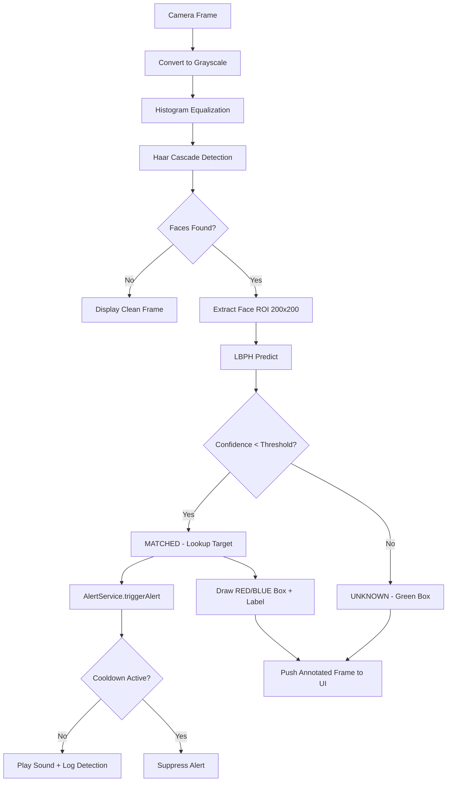

# DrishtiX — Master Blueprint

> **Version**: 1.1.0  
> **Architecture**: JavaFX MVC + MongoDB Java Driver + OpenCV/JavaCV  
> **Database**: MongoDB 6.0+  
> **Build**: Maven Shade (fat JAR)

---

## 1. System Overview

**DrishtiX** is an advanced facial recognition and alert system designed for real-time target identification. It combines live camera feed analysis with a registered watchlist to detect and alert operators when persons of interest (Criminals, Missing Persons) are spotted.

### Core Capabilities
- **Real-time Video Feed**: Live camera capture with face detection
- **Face Recognition**: LBPH (Local Binary Patterns Histograms) face recognizer
- **Audible Alerts**: Category-based audio alerts with per-target cooldown
- **Image Scanner**: Upload and scan static images against the watchlist
- **Detection Logging**: Full audit trail with CSV export
- **Configuration Management**: Database-backed runtime configuration

---

## 2. Architecture

### 2.1 MVC Pattern

```
┌─────────────────────────────────────────────────────────────────┐
│                       PRESENTATION LAYER                        │
│  ┌──────────────┐  ┌──────────────┐  ┌──────────────────────┐  │
│  │ main_view    │  │ dashboard_   │  │ registry_view.fxml   │  │
│  │ .fxml        │  │ view.fxml    │  │ detection_log_view   │  │
│  │              │  │              │  │ image_scan_view      │  │
│  │              │  │              │  │ settings_view.fxml   │  │
│  └──────────────┘  └──────────────┘  └──────────────────────┘  │
│  CSS: drishtix-dark.css                                         │
├─────────────────────────────────────────────────────────────────┤
│                       CONTROLLER LAYER                          │
│  MainController → DashboardController, RegistryController,     │
│                   ImageScanController, DetectionLogController, │
│                   SettingsController                            │
├─────────────────────────────────────────────────────────────────┤
│                       SERVICE LAYER                             │
│  FaceProcessingService │ RecognitionService │ AlertService      │
│  TargetRegistryService │ DetectionLogService│ ConfigurationSvc  │
│  ExportService                                                  │
├─────────────────────────────────────────────────────────────────┤
│                       DAO LAYER (MongoDB)                       │
│  DatabaseManager │ TargetDAO │ TargetImageDAO │ DetectionLogDAO │
│  AlertConfigDAO  │ AuditLogDAO │ CameraSourceDAO               │
├─────────────────────────────────────────────────────────────────┤
│                       MODEL LAYER                               │
│  TargetRegistry │ TargetCategory │ TargetImage │ DetectionLog   │
│  AlertConfig    │ AuditLogEntry  │ CameraSource│ RecognitionResult│
├─────────────────────────────────────────────────────────────────┤
│                       UTILITY LAYER                             │
│  AppConstants │ ThreadPools │ FxImageConverter │ AutoCloseableMat│
│  SoundGenerator                                                 │
├─────────────────────────────────────────────────────────────────┤
│                       EXCEPTION LAYER                           │
│  DatabaseException │ FaceNotFoundException │ RecognitionException│
└─────────────────────────────────────────────────────────────────┘
```

### 2.2 Thread Pool Architecture

| Thread Pool | Threads | Purpose |
|---|---|---|
| **JavaFX Application Thread** | 1 (managed by JFX) | UI rendering, FXML events |
| **Video Inference Pool** | 2 (daemon) | Camera frame capture, face detection, LBPH recognition |
| **Audio Alert Pool** | 1 (daemon) | Asynchronous sound playback |
| **Scheduled Pool** | 1 (daemon) | Periodic tasks (snapshot cleanup) |

### 2.3 Entry Point

```
DrishtiXLauncher.main() → DrishtiXApp.main() → JavaFX.launch()
    → DrishtiXApp.start() → load main_view.fxml
        → MainController.initialize() → load dashboard_view.fxml into contentArea
```

`DrishtiXLauncher` is a plain Java class that delegates to `DrishtiXApp` to work around the Maven Shade plugin limitation where JavaFX `Application` classes cannot be the main class in a shaded JAR.

---

## 3. Database (MongoDB 6.0+)

### Initialization: `database/drishtix_init.js`

Run: `mongosh drishtix_db database/drishtix_init.js`

#### Collections

| Collection | Purpose |
|---|---|
| `targets` | Registered watchlist targets (criminals, missing persons) |
| `target_images` | Face photos per target (up to 5 per target) |
| `camera_sources` | Configured camera sources (device index or RTSP URL) |
| `detection_logs` | Detection event log (timestamped, with confidence scores) |
| `alert_config` | Runtime configuration key-value store |
| `audit_log` | Administrative action audit trail |
| `counters` | Auto-increment sequence counters for integer IDs |

#### Document Schemas

```mermaid
erDiagram
    targets ||--o{ target_images : "has photos"
    targets ||--o{ detection_logs : "is detected"
    camera_sources ||--o{ detection_logs : "captures"
    targets ||--o{ audit_log : "tracks"

    targets {
        int _id PK "auto-increment"
        string full_name
        string category "CRIMINAL or MISSING_PERSON"
        string case_number UK
        string description
        string profile_image_path
        boolean is_active
        int recognizer_label UK
        Date created_at
        Date updated_at
    }

    target_images {
        int _id PK "auto-increment"
        int target_id "references targets._id"
        string image_path
        string template_path
        int image_order
        Date uploaded_at
    }

    camera_sources {
        int _id PK "auto-increment"
        string camera_name
        string source_uri
        boolean is_active
        Date created_at
    }

    detection_logs {
        long _id PK "auto-increment"
        int target_id "references targets._id"
        Date detection_timestamp
        double match_confidence_score
        string snapshot_path
        int camera_id "references camera_sources._id"
        string location_tag
        Date created_at
    }

    alert_config {
        string config_key UK
        string config_value
        string description
        Date updated_at
    }

    audit_log {
        long _id PK "auto-increment"
        string action_type
        int target_id
        string performed_by
        string details
        Date performed_at
    }
```



---

## 4. Face Recognition Pipeline



---

## 5. Configuration Keys

| Key | Default | Description |
|---|---|---|
| `confidence_threshold` | 80.0 | LBPH distance threshold (lower = stricter match) |
| `alert_cooldown_seconds` | 30 | Seconds between re-alerts for same target |
| `video_fps_target` | 15 | Target FPS for video capture loop |
| `audio_enabled` | true | Enable/disable audible alerts |
| `face_detection_method` | HAAR | Face detection backend |
| `min_face_size` | 80 | Minimum face size in pixels |
| `auto_start_camera` | true | Auto-start camera on dashboard load |
| `snapshot_retention_days` | 90 | Days to retain detection snapshots |

---

## 6. File Structure

```
services/drishtix-app/
├── pom.xml
├── mvnw / mvnw.cmd
├── src/main/java/com/drishtix/
│   ├── DrishtiXApp.java           # JavaFX Application entry
│   ├── DrishtiXLauncher.java      # Main class for fat JAR
│   ├── controller/
│   │   ├── MainController.java    # Sidebar navigation
│   │   ├── DashboardController.java # Camera feed + recognition
│   │   ├── RegistryController.java  # Target CRUD
│   │   ├── ImageScanController.java # Static image scanning
│   │   ├── DetectionLogController.java # Log browsing + export
│   │   └── SettingsController.java  # Configuration panel
│   ├── dao/
│   │   ├── DatabaseManager.java   # HikariCP singleton
│   │   ├── TargetDAO.java
│   │   ├── TargetImageDAO.java
│   │   ├── DetectionLogDAO.java
│   │   ├── AlertConfigDAO.java
│   │   ├── AuditLogDAO.java
│   │   └── CameraSourceDAO.java
│   ├── model/
│   │   ├── TargetRegistry.java
│   │   ├── TargetCategory.java    # CRIMINAL, MISSING_PERSON enum
│   │   ├── TargetImage.java
│   │   ├── DetectionLog.java
│   │   ├── AlertConfig.java
│   │   ├── AuditLogEntry.java
│   │   ├── CameraSource.java
│   │   └── RecognitionResult.java
│   ├── service/
│   │   ├── FaceProcessingService.java  # Haar cascade + ROI extraction
│   │   ├── RecognitionService.java     # LBPH training + prediction
│   │   ├── AlertService.java           # Audio alerts + cooldown
│   │   ├── ConfigurationService.java   # DB-backed config cache
│   │   ├── TargetRegistryService.java  # Registration workflow
│   │   ├── DetectionLogService.java    # Log queries
│   │   └── ExportService.java          # CSV export
│   ├── util/
│   │   ├── AppConstants.java
│   │   ├── ThreadPools.java
│   │   ├── FxImageConverter.java  # Mat ↔ JavaFX Image
│   │   ├── AutoCloseableMat.java
│   │   └── SoundGenerator.java   # Generates WAV files at startup
│   └── exception/
│       ├── DatabaseException.java
│       ├── FaceNotFoundException.java
│       └── RecognitionException.java
├── src/main/resources/
│   ├── config.properties
│   ├── logback.xml
│   ├── css/drishtix-dark.css
│   ├── fxml/ (5 FXML view files)
│   ├── cascades/haarcascade_frontalface_alt2.xml
│   └── sounds/ (alarm_criminal.wav, chime_missing.wav)
├── data/
│   ├── uploads/    # Uploaded target photos
│   ├── templates/  # Extracted face templates (200x200 grayscale)
│   └── snapshots/  # Detection event snapshots
└── database/
    └── drishtix_init.js
```

---

## 7. Build & Run

### Prerequisites
- **JDK 17+**
- **MongoDB 6.0+** running locally (default: `mongodb://localhost:27017`)
- **Webcam** (optional — app still works for image scanning without camera)

### Database Setup
```bash
mongosh drishtix_db database/drishtix_init.js
```

### Build
```bash
cd services/drishtix-app
set MAVEN_OPTS=-Xmx2g
./mvnw clean package -DskipTests
```

### Run
```bash
java -jar target/drishtix-app-1.0.0.jar
```

### Configuration
Copy and edit `config.properties` in the working directory to override defaults:
```properties
db.uri=mongodb://localhost:27017
db.name=drishtix_db
```

---

## 8. Key Design Decisions

| Decision | Rationale |
|---|---|
| LBPH over DNN | Runs without GPU, suitable for real-time on CPU, trainable with few images |
| MongoDB over MySQL | Schema-flexible, lighter footprint, no JDBC boilerplate, built-in connection pooling |
| Counter-based IDs | Preserves integer IDs expected by all service/controller layers, avoids ObjectId refactor |
| Maven Shade | Single fat JAR deployment, no external dependencies needed |
| DrishtiXLauncher wrapper | Required workaround for JavaFX + Shade plugin module limitation |
| Per-target cooldown | Prevents alert fatigue from continuous camera matches |
| 3-pool threading | Isolates UI responsiveness from video processing and audio playback |
| Graceful DB fallback | App can start and display UI even without database connectivity |

---

## 9. Completed Components

The following critical core components have been recently implemented and stabilized:
- **Camera Initialization Fix**: Repaired the `OpenCVFrameGrabber` initialization by removing the unsupported `+ 700` backend offset, ensuring cross-platform stability.
- **Capture Loop Resilience**: Implemented exponential back-off and auto-stop mechanisms after consecutive frame grab failures to prevent infinite error flooding and JVM crashes.
- **MongoDB Migration**: Migrated the entire DAO layer from MySQL/HikariCP/JDBC to MongoDB Java Driver:
  - `DatabaseManager` rewritten from HikariCP connection pool to `MongoClient` singleton with `ping`-based health checks.
  - All 6 DAOs (`TargetDAO`, `TargetImageDAO`, `DetectionLogDAO`, `AlertConfigDAO`, `AuditLogDAO`, `CameraSourceDAO`) rewritten from SQL/PreparedStatement to MongoDB Document API.
  - Counter-based auto-increment ID pattern preserves integer IDs expected by all service/controller layers.
  - SQL JOINs replaced with batch in-memory enrichment (DetectionLogDAO) and two-step queries (TargetImageDAO).
  - `config.properties` updated from JDBC URL to MongoDB connection string.
  - `database/drishtix_init.js` created to replace `drishtix_schema.sql`.
- **Database Connection Resilience**: 
  - `ConfigurationService` falls back to hardcoded defaults (graceful degradation) when MongoDB is unavailable, allowing the app and camera to function independently.
- **Maven Shade Configuration**: Added `module-info.class` exclusion to `pom.xml` to eliminate packaging warnings and potential runtime classpath conflicts. Memory exhaustion during build resolved via `MAVEN_OPTS=-Xmx2g`.
- **Data Management UI**: Added a "Clear System Data" danger zone to the Settings view, allowing operators to wipe the database registry and logs directly from the UI with proper safety confirmation.

---

## 10. Next Immediate Steps & Pending Bugs

### Pending Bugs / Issues
- **None currently identified**. The previous Maven memory exhaustion bug was resolved, and the camera initialization crash was fixed via backoff retry logic. 

### Next Immediate Steps
1. **End-to-End Field Testing**: Perform a full end-to-end run of the application (face registration -> detection -> audio alert) with real users to verify LBPH accuracy and UI responsiveness.

2. **Automated Testing Setup**: The `QA Engineer (@qa)` role requires automated tests. Setup JUnit and TestFX for UI testing, and unit tests for the MongoDB DAO layer.
