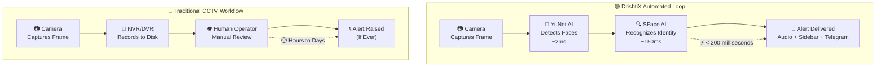
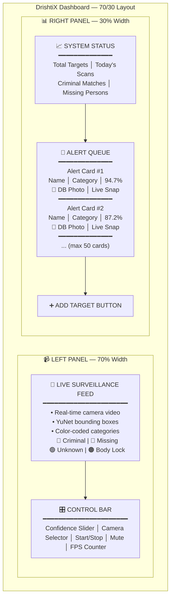
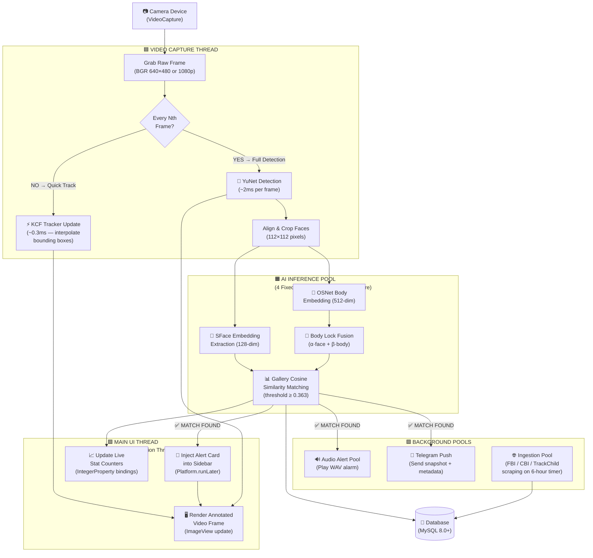
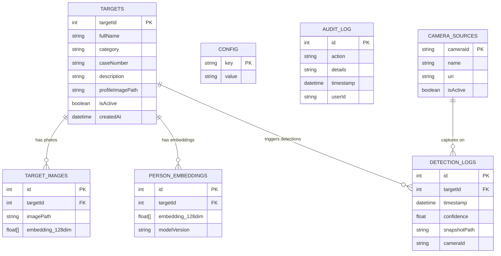

# CHAPTER 3: REQUIREMENTS AND ANALYSIS

---

## 3.1 Problem Definition

### 3.1.1 The Core Flaw: Recording vs. Reacting

The world has over one billion CCTV cameras, yet the vast majority of them do exactly the same thing — they **record video and store it on a hard drive**. That's it. They don't think, they don't recognize anyone, and they certainly don't raise an alarm.

The actual work of figuring out *who* appeared on camera is left entirely to a human operator sitting in a control room, watching 16 to 64 screens simultaneously, trying to match every passing face against a stack of printed photographs. This is an impossible task. Research in human factors has proven that a person's ability to stay alert during monotonous visual monitoring **drops below 50% accuracy within just 20 minutes**. This isn't a training problem — it's a fundamental limitation of human attention.

The result? A wanted criminal can walk through a surveilled corridor, board a bus, and disappear long before anyone reviews the footage. The "alert," if it comes at all, arrives hours or even days later during a post-incident forensic review. The footage ends up as courtroom evidence — not as a tool for catching the suspect in real time.

**In simple terms:**
- **Traditional CCTV** = A security camera that just records. Somebody has to watch the tape later.
- **DrishtiX** = A security camera that **watches for you**, recognizes faces in real time, and instantly tells you when someone on a watchlist appears.

### 3.1.2 Traditional vs. DrishtiX: A Side-by-Side Comparison

The flowchart below contrasts the slow, human-dependent traditional CCTV workflow with the fully automated, sub-second DrishtiX detection loop:

**The key difference**: Traditional surveillance takes **hours to days** to maybe produce an alert. DrishtiX does it in **under 200 milliseconds** — faster than you can blink.

### 3.1.3 The Alert Fatigue Problem

Even when some automated face detection is bolted onto a traditional system, poor design can make things *worse*. If every detection pops up a modal dialog box that covers the camera feed, the operator's screen is constantly blocked. If the same person is re-detected every 2 seconds, the operator gets bombarded with hundreds of identical popups per hour. Within minutes, operators start reflexively clicking "close" without even reading the alert — a phenomenon known as **alert fatigue**.

### 3.1.4 How DrishtiX Solves All Three Problems

DrishtiX v3.0 is engineered to address each of these failure modes:

| Problem | DrishtiX Solution |
|---|---|
| **Human vigilance decay** | AI-powered automated face recognition replaces the human matching task entirely |
| **Slow response times** | The entire pipeline runs in under 200 milliseconds, end-to-end |
| **Alert fatigue** | Alerts are delivered as non-blocking sidebar cards that never cover the live camera feed, with smart cooldowns to suppress duplicate alerts |

---

## 3.2 Requirements Specification

### 3.2.1 Functional Requirements

The following table summarizes the core features that DrishtiX must provide:

| ID | Requirement | Description |
|---|---|---|
| FR-01 | **Live Video Capture** | Capture and display live video from a connected camera (USB, integrated, or RTSP network stream) at 15+ FPS |
| FR-02 | **Multi-Face Detection** | Detect and locate 9–10+ faces simultaneously in a single frame using the YuNet deep learning model |
| FR-03 | **Real-Time Face Recognition** | Extract SFace embeddings from detected faces and match them against the watchlist database using cosine similarity |
| FR-04 | **Body Re-Identification** | When a recognized person's face is lost (turned head, occlusion), maintain tracking using body-based OSNet embeddings and KCF/CSRT trackers |
| FR-05 | **Non-Blocking Sidebar Alerts** | Display detection alerts as styled cards in a scrollable sidebar — showing name, category, confidence, case number, snapshot, and timestamp — without blocking the camera feed |
| FR-06 | **Target Registration** | Allow operators to register new persons of interest by uploading a photo, entering identifying details, and automatically computing the face embedding |
| FR-07 | **Multi-Channel Alerts** | On a positive match, simultaneously trigger an audible alarm, a Telegram push notification with a snapshot, and a sidebar alert card |
| FR-08 | **Background Watchlist Sync** | Automatically ingest wanted profiles from external sources (FBI API, CBI, TrackChild) on a configurable schedule, without disrupting live surveillance |
| FR-09 | **Runtime Configuration** | Let operators adjust detection thresholds, cooldown periods, audio settings, and ingestion schedules without restarting the application |
| FR-10 | **Audit Logging** | Record all critical operations (target additions, deletions, configuration changes, alert events) to an immutable audit trail |

### 3.2.2 Non-Functional Requirements

These are the performance and quality benchmarks the system must meet:

| NFR ID | Category | Requirement | Target | Why It Matters |
|---|---|---|---|---|
| NFR-01 | **UI Latency** | Time from detection event to alert card appearing on screen | **≤ 100 ms** | The operator must perceive alerts as instantaneous — no perceptible lag between detection and notification |
| NFR-02 | **Inference Latency** | SFace embedding extraction + gallery matching per face | **≤ 150 ms** | Recognition runs on a dedicated 4-thread pool, ensuring the camera feed never stutters |
| NFR-03 | **End-to-End Latency** | Total pipeline: frame capture → annotated alert delivery | **≤ 200 ms** | Faster than a human blink (300–400 ms), making the system perceptually instantaneous |
| NFR-04 | **Uptime** | Continuous operation without crashes or memory leaks | **99.5%** | Must sustain uninterrupted 8–12 hour operational shifts without degradation |
| NFR-05 | **Scalability** | Watchlist gallery capacity | **10,000+ profiles** | The system must handle large-scale watchlists using efficient ConcurrentHashMap storage with pre-computed centroids |
| NFR-06 | **Frame Rate** | Live camera feed rendering | **≥ 15 FPS** | Minimum for smooth, usable video; 30 FPS preferred |
| NFR-07 | **Privacy** | Data locality | **100% on-device** | No frames, embeddings, or personally identifiable information ever leave the machine |
| NFR-08 | **Thermal Safety** | Sustained CPU utilization | **≤ 60%** | Frame-skipping and lightweight trackers prevent thermal throttling on laptops |

---

## 3.3 Planning and Scheduling

### 3.3.1 Iterative Development Phases

DrishtiX v3.0 was built in four incremental phases. Each phase was completed and validated before the next one began, ensuring a stable foundation at every stage:

- **Phase 1: Core AI Integration (4 weeks)**
  - Replaced legacy Haar Cascade and LBPH algorithms with YuNet (detection) and SFace (recognition) deep learning models
  - Integrated ONNX model loading through OpenCV's DNN module
  - Built a thread-safe embedding gallery using `ConcurrentHashMap`
  - Preserved legacy Haar/LBPH as a fallback option

- **Phase 2: UI Modernization (3 weeks)**
  - Redesigned the entire interface around a single-screen Bento Grid dashboard
  - Implemented a WCAG AA-compliant dark theme via CSS
  - Built the non-blocking sidebar alert queue with a 50-card memory cap
  - Added reactive stat counters bound to JavaFX `IntegerProperty` for live metric updates

- **Phase 3: Alert Pipeline & Background Sync (4 weeks)**
  - Implemented the frame-skip strategy (run AI inference every Nth frame, use lightweight trackers in between)
  - Integrated KCF/CSRT object trackers for inter-frame face position interpolation
  - Added OSNet body re-identification for persistent tracking when faces are lost
  - Built the Telegram Bot API push notification system
  - Created the Background Ingestion Engine (automated FBI/CBI/TrackChild scraping)

- **Phase 4: Production Hardening (2 weeks)**
  - Fixed alert card duplication race conditions
  - Standardized all UI mutations to use `Platform.runLater()` for thread safety
  - Added recognition pool pre-warming to eliminate cold-start latency
  - Formalized the multi-pool threading architecture with graceful shutdown hooks

### 3.3.2 Simplified Gantt Chart

| Phase | Duration | Key Deliverable |
|---|---|---|
| Phase 1: Core AI Integration | 4 weeks | YuNet + SFace fully operational on CPU |
| Phase 2: UI Modernization | 3 weeks | Bento Grid dashboard with dark theme |
| Phase 3: Alert Pipeline & Background Sync | 4 weeks | Body lock, Telegram push, ingestion engine |
| Phase 4: Production Hardening | 2 weeks | Race condition fixes, pre-warming, shutdown hooks |
| **Total** | **13 weeks** | **Production-ready DrishtiX v3.0** |

---

## 3.4 Software and Hardware Requirements

### 3.4.1 Software Requirements (Tech Stack)

DrishtiX is built on a focused, well-integrated tech stack designed for **maximum performance on a single machine** with zero cloud dependencies:

| Component | Version | Purpose |
|---|---|---|
| **Java** | JDK 17+ (LTS) | Core application runtime — long-term support ensures stability |
| **JavaFX** | 21.0.2+ | GPU-accelerated desktop UI framework for rendering the dashboard, live video feed, and alert cards |
| **OpenCV** | 4.9.0+ (via JavaCV 1.5.10) | Computer vision engine — provides the DNN module for YuNet/SFace inference, KCF/CSRT tracking, and image processing |
| **MySQL** | 8.0+ | Relational database for persistent storage of target profiles, embeddings, detection logs, and configuration |
| **Apache Maven** | 3.8+ | Build tool and dependency manager — produces a single fat JAR for deployment |
| **Python** | 3.10+ (optional) | Runs the standalone FastAPI ReID microservice for OSNet body embeddings |

> **Key Design Principle**: The entire system — Java application, database, AI models, and all processing — runs on a single standard laptop. There is **no cloud dependency**. No frames, no embeddings, no personal data ever leaves the machine. This makes DrishtiX suitable for air-gapped, secure, and field deployments where internet connectivity cannot be guaranteed.

### 3.4.2 Hardware Requirements

| Component | Minimum | Recommended | Why |
|---|---|---|---|
| **Processor** | Intel Core i5 (8th Gen) / AMD Ryzen 5 | Intel Core i7 (10th Gen+) with Iris Xe | 4+ cores needed for the multi-pool threading architecture; iGPU accelerates JavaFX rendering |
| **RAM** | 8 GB DDR4 | 16 GB DDR4 | JVM heap + MySQL buffer pool + native OpenCV frame buffers |
| **Storage** | 256 GB SSD | 512 GB NVMe SSD | ONNX AI models (~10 MB), database, ingested images, detection snapshots |
| **Camera** | 720p USB webcam | 1080p integrated/USB | Higher resolution improves small-face detection accuracy at distance |
| **GPU** | Not required (CPU-only operation) | Integrated Intel UHD/Iris Xe | JavaFX uses the iGPU for UI rendering; AI inference runs on CPU |
| **Network** | Not required for core operation | Broadband (for Telegram alerts + watchlist ingestion) | Core surveillance is fully offline; network is optional for push alerts and data scraping |
| **Display** | 1366 × 768 | 1920 × 1080 (Full HD) | Dashboard is optimized for 1280×800+; Full HD provides the best experience |

> **Note on Future Hardware Acceleration**: The ONNX-based architecture is ready for hardware acceleration without code changes. Laptops with an Intel NPU can use **OpenVINO** as an inference backend, and systems with NVIDIA GPUs can use **CUDA/TensorRT** — both selectable through OpenCV's backend API.

---

## 3.5 Preliminary Product Description

### 3.5.1 Dashboard-Centric Interface

The DrishtiX interface is designed around one simple principle: **the operator should never lose sight of the live camera feed**.

Instead of forcing users to switch between multiple tabs or windows, everything lives on a single, unified dashboard screen. The layout follows a **70/30 split**:

- **70% of the screen (left side)**: Dedicated to the **live surveillance feed** — the camera video with real-time AI-drawn bounding boxes around detected faces, color-coded by category (red for criminals, cyan for missing persons, green for unknown faces, amber for body-lock tracking).

- **30% of the screen (right side)**: Houses the **alert queue and system status** — a scrollable list of detection alert cards, live stat counters (total targets, detections today, criminal matches, missing person matches), and quick-action controls.

This layout ensures that no alert, popup, or control panel ever covers the camera feed. The operator always has full visual awareness.

### 3.5.2 The 70/30 UI Layout

### 3.5.3 Alert Card Design

Each alert card in the sidebar is a self-contained intelligence unit. An operator can glance at it and immediately understand *who* was detected, *when*, and *how confident* the system is:

| Field | What It Shows | Purpose |
|---|---|---|
| **Target Name** | Full name from the watchlist database | Instant identification |
| **Category Badge** | Color-coded pill — 🔴 CRIMINAL or 🔵 MISSING PERSON | Visual priority at a glance |
| **Confidence Score** | Cosine similarity percentage (e.g., 94.7%) | Helps the operator judge match quality |
| **Case/FIR Number** | Official case reference number | Immediate legal cross-reference |
| **Database Photo** | The stored reference photo (left side) | Side-by-side visual verification |
| **Live Snapshot** | The frame crop at the moment of detection (right side) | Side-by-side visual verification |
| **Timestamp** | Exact time of detection | Forensic and shift-log documentation |

### 3.5.4 Memory-Safe Alert Queue

The alert queue enforces a strict **50-card cap**. When the queue is full and a new alert arrives, the oldest card is automatically removed. Combined with a per-target cooldown window (default: 30 seconds) that suppresses duplicate alerts for the same person, this ensures:

- **No memory bloat**: The application can run for 8–12 hour shifts without heap exhaustion.
- **No alert flooding**: Operators see only fresh, unique detections — not hundreds of duplicates.

---

## 3.6 Conceptual Models

### 3.6.1 The Three-Pool Threading Architecture (Plain English)

The biggest challenge of running AI on a laptop is preventing the application from **freezing**. If you try to run face detection, face recognition, and draw the video feed all on the same thread, the app will stutter, lag, and become unusable.

DrishtiX solves this by splitting the work across **three main thread pools**, each responsible for a distinct job. Think of it like a restaurant kitchen:

1. **The Main UI Thread** (the waiter) — This thread's only job is to keep the screen updated. It draws the video frames, renders the alert cards, and responds to button clicks. It never does any heavy lifting. **Rule**: No task running on this thread may take longer than 16 milliseconds, or the screen will visibly stutter.

2. **The Video Capture Thread** (the prep cook) — This thread grabs frames from the camera and runs the lightweight **YuNet face detection** model (~2ms per frame). It decides: "Is this a frame where we need full AI analysis, or can we use a quick tracker estimate?" On most frames, it uses a fast KCF tracker (~0.3ms) to interpolate face positions. Only every Nth frame does it trigger a full detection pass.

3. **The AI Inference Pool** (the head chef) — This is a pool of **4 parallel threads** that handle the heavy computational work: extracting SFace face embeddings, computing cosine similarity against the entire watchlist gallery, and running OSNet body re-identification. Because this pool is independent from the video thread, the camera feed keeps running smoothly even while the AI is crunching numbers.

In addition to these three core pools, DrishtiX also runs two background support pools:
- **Audio Alert Pool** (1 thread) — Plays alarm sounds and sends Telegram notifications without blocking anything else.
- **Ingestion Pool** (2 threads, lowest priority) — Runs the background web scrapers (FBI, CBI, TrackChild) on a schedule, at minimum CPU priority so it never steals resources from the camera or AI.

### 3.6.2 Threading Data Flow Diagram

The following diagram shows how data flows through the three main pools — from the camera, through AI processing, to the operator's screen:

### 3.6.3 The Threading Contract (Summary)

Each pool operates under a strict contract to guarantee that the application never freezes:

| Pool | Threads | Strict Rule | What Happens If Violated |
|---|---|---|---|
| **Main UI Thread** | 1 (JavaFX) | No callback may exceed **16ms** | Screen freezes — frames drop, buttons become unresponsive |
| **Video Capture Pool** | 2 (daemon) | Must yield frames at **≥ 15 FPS** | Video feed stutters — operator loses situational awareness |
| **Recognition Inference Pool** | 4 (fixed) | Each face is independent — **never block capture** | Camera thread stalls waiting for AI — causes cascading FPS drop |
| **Audio Alert Pool** | 1 (daemon) | Fire-and-forget — **never block inference** | Alarm playback delays recognition of the next face |
| **Ingestion Pool** | 2 (MIN priority) | **Lowest CPU priority** — never steal cycles from inference | Web scraping slows down the AI — defeats the purpose of the system |

### 3.6.4 Entity Relationship Model

The database stores four primary entity types with clear relationships:

### 3.6.5 Use Case Summary

| Use Case | Who Triggers It | What Happens |
|---|---|---|
| **UC-01**: Monitor Live Feed | Operator starts camera | System renders annotated video at 15+ FPS with color-coded bounding boxes |
| **UC-02**: Detect Known Target | System (automatic) | Face matched → sidebar alert + audio alarm + Telegram push notification |
| **UC-03**: Register New Target | Operator clicks "Add Target" | Upload photo → AI extracts embedding → stored in watchlist gallery |
| **UC-04**: Search Targets | Operator types in search field | Target table filters by name or case number in real time |
| **UC-05**: Adjust Threshold | Operator moves confidence slider | Recognition sensitivity updates live without restart |
| **UC-06**: Background Ingestion | System (scheduled, every 6 hours) | Scrapes FBI/CBI/TrackChild → downloads photos → auto-registers new targets |
| **UC-07**: Body Lock Tracking | System (automatic) | Recognized face lost → OSNet body handoff → KCF tracker maintains persistent lock |
| **UC-08**: View Detection History | Operator navigates to registry | Historical detection logs displayed with timestamps, confidence, and snapshots |

---
