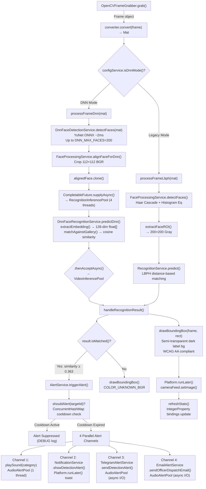
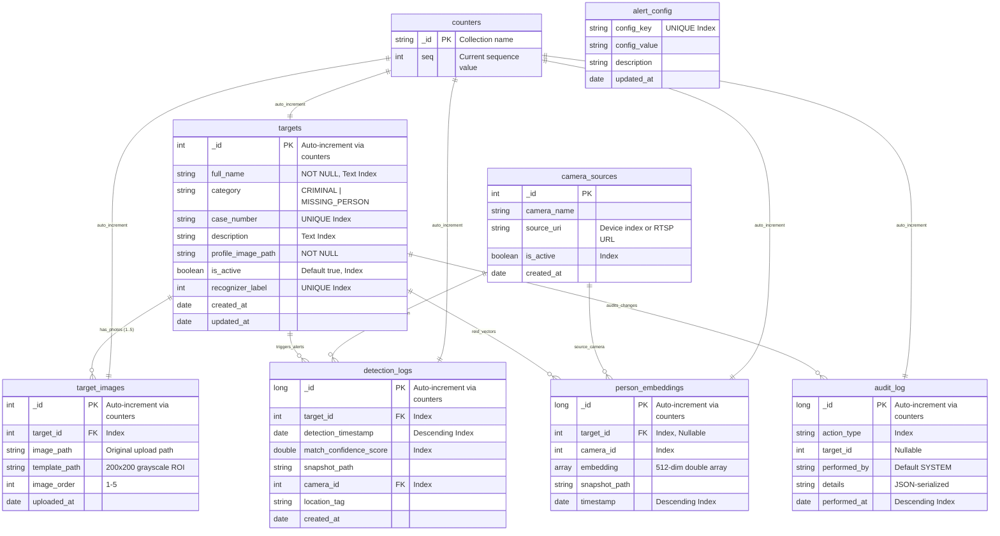
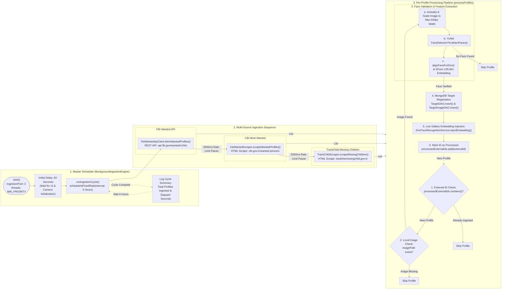
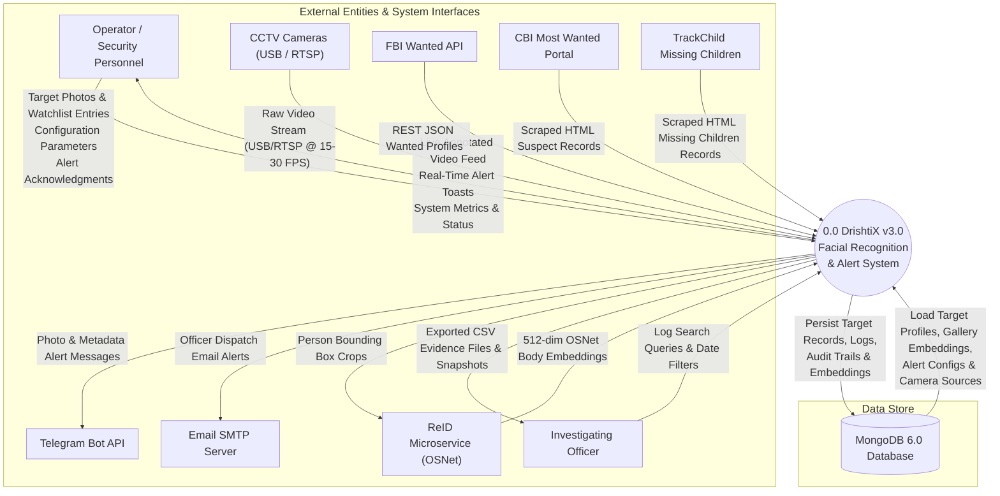
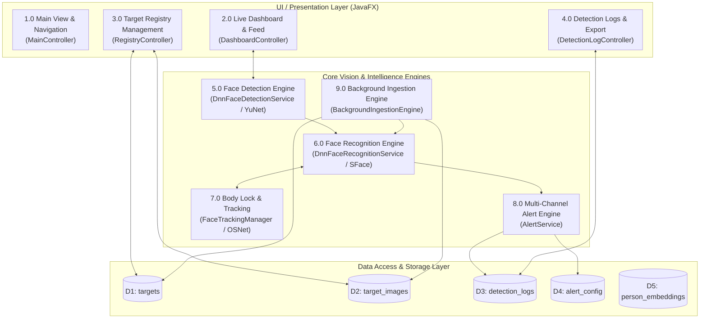

```mermaid
%%{init: {"theme": "default", "themeVariables": {"fontSize": "26px", "fontFamily": "arial", "nodePadding": 18}}}%%
flowchart LR
    subgraph POOL2["Pool 2: Video Inference (2 Threads, Daemon)"]
        direction TB
        VI1["1. OpenCVFrameGrabber.grab()<br/>Capture RTSP/USB Frame"]
        VI2["2. DnnFaceDetectionService.detectFaces()<br/>YuNet ONNX Detection (~2ms)"]
        VI3["3. FaceProcessingService.alignFaceForDnn()<br/>Crop & Align 112×112 BGR"]
        VI4["4. drawBoundingBox() & putText()<br/>Annotate Frame with WCAG Label"]
        VI5["5. imwrite() Snapshot to Disk"]
        VI6["6. DetectionLogService.logDetection()"]
        
        VI1 --> VI2 --> VI3
        VI4 --> VI5 --> VI6
    end

    subgraph POOL3["Pool 3: Recognition Inference (4 Threads, Daemon)"]
        direction TB
        RI1["1. extractEmbedding()<br/>SFace 128-dim Float Vector<br/>(ThreadLocal Model Instance)"]
        RI2["2. matchAgainstGallery()<br/>ConcurrentHashMap Gallery<br/>(ReentrantReadWriteLock)"]
        RI3["3. VectorMathUtil.cosineSimilarity()<br/>Match Threshold ≥ 0.363"]
        
        RI1 --> RI2 --> RI3
    end

    subgraph POOL1["Pool 1: JavaFX Application Thread (1 Thread)"]
        direction TB
        UI1["1. cameraFeed.setImage(frame)<br/>Update 70% Viewport"]
        UI2["2. alertQueueBox.getChildren().add(0, card)<br/>Prepend Alert (Cap: 50)"]
        UI3["3. IntegerProperty.set()<br/>Reactive Stat Bindings"]
        UI4["4. Notifications.create().show()<br/>ControlsFX Sliding Toast"]
        
        UI1 --> UI2 --> UI3 --> UI4
    end

    subgraph POOL4["Pool 4: Audio & Push Alert (1 Thread, Daemon)"]
        direction TB
        AA1["1. AlertService.playSound()<br/>Category WAV Playback"]
        AA2["2. TelegramAlertService.send()<br/>HTTP POST Snapshot Photo"]
        AA3["3. EmailAlertService.send()<br/>SMTP Officer Dispatch"]
        
        AA1 --> AA2 --> AA3
    end

    subgraph BACKGROUND["Background Auxiliary Pools"]
        direction TB
        subgraph POOL5["Pool 5: Ingestion Pool (2 Threads, MIN_PRIORITY)"]
            IG1["BackgroundIngestionEngine<br/>FBI API + CBI + TrackChild Sync"]
        end
        subgraph POOL6["Pool 6: Scheduled Pool (1 Thread)"]
            SC1["Periodic Snapshot Purge (90 Days)<br/>Configuration Refresh"]
        end
    end

    VI3 -->|"Async Handoff:<br/>CompletableFuture.supplyAsync()"| RI1
    RI3 -->|"Result Callback:<br/>.thenAcceptAsync()"| VI4

    VI4 -->|"Platform.runLater()"| UI1
    VI6 -->|"Async Push:<br/>CompletableFuture.runAsync()"| AA1

    IG1 -->|"Inject Embedding"| RI2
```

# DrishtiX v3.0 — Repository-Accurate Architectural Diagrams

> All diagrams are based on a complete scan of the DrishtiX repository at `d:\TY-IT\Enterprise_Java\Java_project\services\drishtix-app\`.
> Every class name, method call, thread pool name, and collection field is traced directly to source code.

---

## 1. System Flowchart — Video Capture to UI Alert

> Source files: `DashboardController.java`, `DnnFaceDetectionService.java`, `DnnFaceRecognitionService.java`, `AlertService.java`

---

## 2. ER Diagram — MongoDB Schema

> Source files: `drishtix_init.js`, `TargetDAO.java`, `DetectionLogDAO.java`, `PersonEmbeddingDAO.java`

---

## 3. Table Design — Complete Field Specifications

### Collection: `targets`

| Field | BSON Type | Constraint | Index | Source: `TargetDAO.mapDocument()` |
|-------|-----------|-----------|-------|----------------------------------|
| `_id` | Integer | PK (auto-increment via `counters`) | Primary | `doc.getInteger("_id")` |
| `full_name` | String | NOT NULL | Text Index (compound with `description`) | `doc.getString("full_name")` |
| `category` | String | Enum: `"CRIMINAL"`, `"MISSING_PERSON"` | Secondary | `TargetCategory.fromDbValue(doc.getString("category"))` |
| `case_number` | String | UNIQUE | Unique Index | `doc.getString("case_number")` |
| `description` | String | Nullable | Text Index (compound) | `doc.getString("description")` |
| `profile_image_path` | String | NOT NULL | — | `doc.getString("profile_image_path")` |
| `is_active` | Boolean | Default: `true` | Secondary | `doc.getBoolean("is_active", true)` |
| `recognizer_label` | Integer | UNIQUE | Unique Index | `doc.getInteger("recognizer_label", 0)` |
| `created_at` | Date | Auto-populated | — | `doc.getDate("created_at")` |
| `updated_at` | Date | Auto-populated | — | `doc.getDate("updated_at")` |

### Collection: `target_images`

| Field | BSON Type | Constraint | Index | Source: `TargetImageDAO` |
|-------|-----------|-----------|-------|--------------------------|
| `_id` | Integer | PK (auto-increment) | Primary | Auto-generated |
| `target_id` | Integer | FK → `targets._id` | Secondary | Application-managed cascade |
| `image_path` | String | NOT NULL | — | Original uploaded image |
| `template_path` | String | NOT NULL | — | 200×200 grayscale ROI |
| `image_order` | Integer | Range: 1–5 | — | `MAX_PHOTOS_PER_TARGET = 5` |
| `uploaded_at` | Date | Auto-populated | — | |

### Collection: `detection_logs`

| Field | BSON Type | Constraint | Index | Source: `DetectionLogDAO` |
|-------|-----------|-----------|-------|--------------------------|
| `_id` | Long | PK (auto-increment) | Primary | `getNextSequenceLong("detection_logs")` |
| `target_id` | Integer | FK → `targets._id` | Secondary | |
| `detection_timestamp` | Date | NOT NULL | Descending | Sorted newest-first |
| `match_confidence_score` | Double | NOT NULL | Secondary | LBPH distance or cosine similarity |
| `snapshot_path` | String | Nullable | — | Annotated frame PNG |
| `camera_id` | Integer | FK → `camera_sources._id` | Secondary | |
| `location_tag` | String | Nullable | — | Optional geolocation |
| `created_at` | Date | Auto-populated | — | |

---

## 4. Process Flow — Background Ingestion Engine

> Source: `BackgroundIngestionEngine.java`, `FbiWantedApiClient.java`, `CbiWantedScraper.java`, `TrackChildScraper.java`

---

## 5. DFD Level 0 — Context Diagram

---

## 6. DFD Level 1 — Module Decomposition

---

