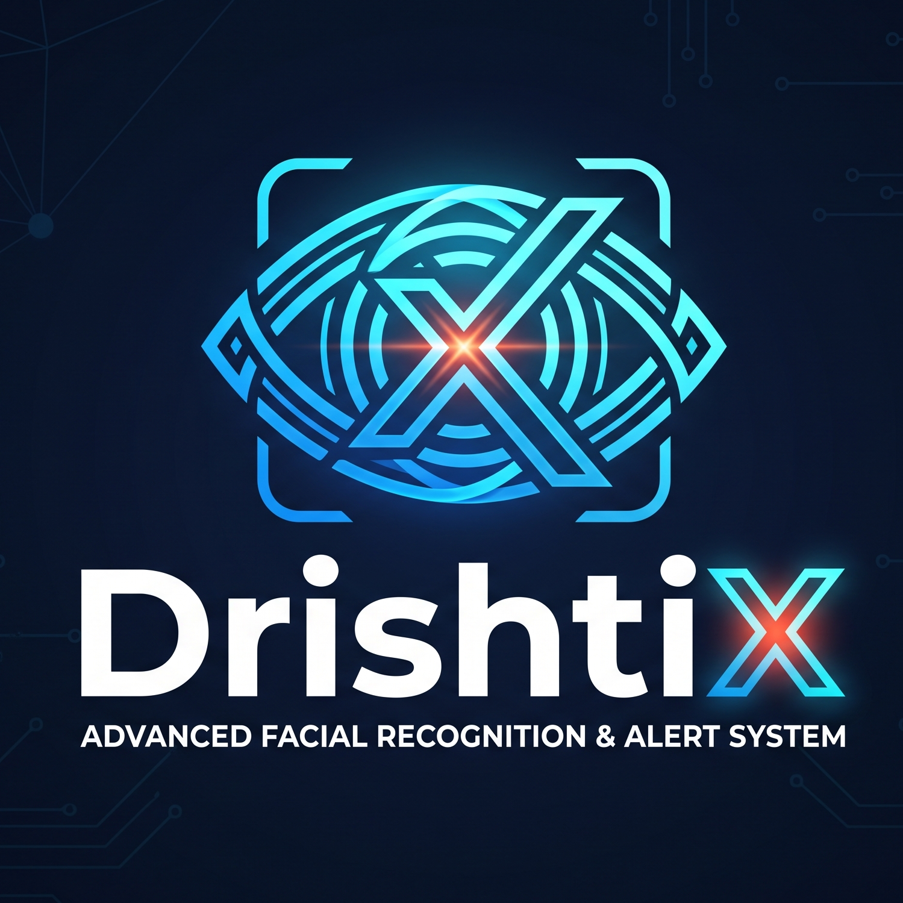
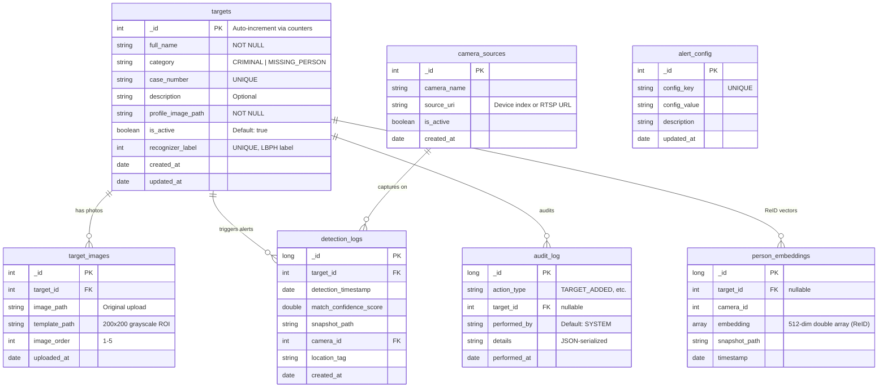

<![CDATA[<p align="center">
  
</p>

<h1 align="center">DrishtiX v3.0</h1>
<h3 align="center">Advanced Facial Recognition & Alert System</h3>
<p align="center">
  <strong>Technical Documentation & Developer Guide</strong><br/>
  <em>Real-Time Watchlist Identification · Multi-Channel Alerting · Cross-Camera Person Re-Identification</em>
</p>

<p align="center">
  
  
  
  
  
  
</p>

---

> **Document Classification**: Internal — Engineering & Operations  
> **Applicable Version**: 3.0.0 (DNN Pipeline + Multi-Channel Push Engine)  
> **Last Updated**: July 2026  
> **Maintainer**: DrishtiX Engineering Team  

---

## Table of Contents

1. [Executive Summary & Vision](#1-executive-summary--vision)
2. [User Personas & Epic-Level User Stories](#2-user-personas--epic-level-user-stories)
3. [Deep Learning AI Architecture & Threading Model](#3-deep-learning-ai-architecture--threading-model)
4. [UI/UX Modernization & State Management Bug Fixes](#4-uiux-modernization--state-management-bug-fixes)
5. [Functional Modules (Deep Dive)](#5-functional-modules-deep-dive)
6. [Non-Functional Requirements (NFRs)](#6-non-functional-requirements-nfrs)
7. [Technology Stack & Database Schema](#7-technology-stack--database-schema)
8. [Deployment, Configuration & Testing](#8-deployment-configuration--testing)

---

# 1. Executive Summary & Vision

## 1.1 The Problem: Manual Surveillance in a Real-Time World

Traditional CCTV infrastructure suffers from a catastrophic design flaw: **it produces video, not intelligence**. In jurisdictions across India and globally, surveillance operators are expected to monitor banks of 16–64 camera feeds simultaneously, mentally cross-referencing each face against thousands of printed FIR photographs pinned to a corkboard or stored in unindexed binder volumes. The cognitive overload is immense. Studies consistently demonstrate that human vigilance in sustained monitoring tasks degrades below 50% accuracy within the first 20 minutes. In practice, a wanted criminal can pass through a surveilled corridor, and the alert — if it ever arrives — comes hours or days later during post-incident review, rendering the footage usable only as retrospective evidence, not as an operational tool for interdiction.

The latency of this workflow is measured in **hours to days**:

```
┌───────────┐     ┌────────────┐     ┌──────────────┐     ┌──────────────┐
│  Camera   │────▶│  NVR/DVR   │────▶│  Manual      │────▶│  Alert       │
│  Captures │     │  Records   │     │  Review      │     │  (if any)    │
│  Frame    │     │  to Disk   │     │  by Operator │     │  to Officer  │
└───────────┘     └────────────┘     └──────────────┘     └──────────────┘
    t = 0           t = 0              t = hours            t = hours+
```

DrishtiX eliminates this latency entirely.

## 1.2 The Solution: Sub-Second Automated Identification

DrishtiX v3.0 collapses the entire surveillance-to-action pipeline into a **sub-second automated loop**:

```
┌───────────┐     ┌────────────┐     ┌──────────────┐     ┌──────────────┐
│  Camera   │────▶│  YuNet DNN │────▶│  SFace DNN   │────▶│  Multi-Chan  │
│  Captures │     │  Detection │     │  Recognition │     │  Alert       │
│  Frame    │     │  (~2ms)    │     │  (~150ms)    │     │  (Audio +    │
│           │     │            │     │              │     │  Toast +     │
│           │     │            │     │              │     │  Telegram)   │
└───────────┘     └────────────┘     └──────────────┘     └──────────────┘
    t = 0           t = 2ms            t = 150ms            t = 200ms
```

From the instant a face appears in the camera's field of view to the instant an actionable alert — complete with the target's name, FIR number, category, and live snapshot — arrives on screen, the total elapsed time is under **200 milliseconds**. This is faster than the human blink reflex (300–400ms).

## 1.3 The Unified Screen Philosophy

DrishtiX is built on a strict **dashboard-centric design philosophy**: the operator must never leave the primary screen. Every critical function — uploading target metadata, monitoring the live feed, reviewing historical alerts, adjusting confidence thresholds, and responding to incoming matches — is accessible from a single, unified interface. There is no tab-switching, no popup windows blocking the feed, and no navigation to secondary pages during active surveillance.

The dashboard layout follows a deliberate **70/30 split**:

| Zone | Allocation | Purpose |
|------|-----------|---------|
| **Left (70%)** | Live Camera Feed | Full-frame, real-time annotated video with bounding boxes, WCAG-compliant labels, and FPS counter |
| **Right (30%)** | Alert Sidebar + Metrics | Dynamic alert card queue (newest-first), reactive stat counters (total targets, criminals, missing, detections today), and camera/recognizer status indicators |

This layout ensures the feed is always the **hero element** — the largest, most prominent visual component — while operational controls and alert information remain immediately accessible without occlusion.

## 1.4 Version Lineage

| Version | Codename | Key Capabilities |
|---------|----------|-------------------|
| **v1.0** | Baseline | Haar Cascade detection + LBPH recognition, single-camera, audio-only alerts, modal popup notifications |
| **v2.0** | ReID Engine | Added Person Re-Identification (OSNet via Python FastAPI), Telegram Bot push alerts, ControlsFX toast notifications, MongoDB vector storage |
| **v3.0** | Deep Vision | Upgraded to YuNet DNN detection (ONNX) + SFace DNN recognition (128-dim embeddings), 4-thread recognition inference pool, legacy HAAR/LBPH fallback, WCAG AA accessibility, premium dark theme, 50-card alert queue with auto-prune |

---

# 2. User Personas & Epic-Level User Stories

## 2.1 Persona: Registry Operator (Admin)

**Profile**: A trained data-entry officer responsible for maintaining the watchlist. They receive FIR documents, court orders, and missing-person reports, then digitize target profiles into DrishtiX. Their primary pain point is the delay between receiving a physical photograph and having it operationally active in the recognition pipeline.

**Goals**:
- Upload target photos and metadata without delay
- Manage (activate, deactivate, delete) watchlist entries
- Ensure data accuracy across case numbers and categories

**Frustrations**:
- Manual photo matching against physical FIR binders
- Duplicate data entry across disconnected systems
- No visibility into whether a target is actively being scanned

### User Stories

#### US-RO-001: Quick Target Registration from Dashboard

> **As a** Registry Operator,  
> **I want to** register a new target directly from the live dashboard without navigating to a separate screen,  
> **So that** I can add a suspect to the watchlist within seconds of receiving their FIR photograph.

**Acceptance Criteria**:
- [ ] A "Quick Add" button is visible on the dashboard at all times
- [ ] Clicking the button opens a `FileChooser` for image upload (supports `.jpg`, `.jpeg`, `.png`)
- [ ] Upon file selection, an inline registration dialog collects: Full Name, Category (CRIMINAL / MISSING_PERSON), Case/FIR Number, and optional Description
- [ ] The system auto-detects the face in the uploaded image using Haar Cascade or YuNet DNN
- [ ] If no face is detected, a clear error toast is displayed: "No face detected in the uploaded image. Please upload a clear frontal photo."
- [ ] Upon successful registration, a success toast confirms: "Target registered: [Name]. DrishtiX is now watching."
- [ ] Dashboard stat counters (Total Targets, Criminals, Missing) auto-increment via bound `IntegerProperty`
- [ ] If in DNN mode, the SFace embedding gallery is asynchronously rebuilt on the `RecognitionInferencePool`

#### US-RO-002: Multi-Photo Enrollment for Improved Accuracy

> **As a** Registry Operator,  
> **I want to** upload up to 5 photographs per target,  
> **So that** the recognition engine has multiple reference angles for improved accuracy under varying pose and lighting conditions.

**Acceptance Criteria**:
- [ ] The `target_images` collection supports up to 5 images per target, enforced by the `image_order` field (values 1–5)
- [ ] Each uploaded image is independently processed: face detected, grayscale ROI extracted (200×200 for LBPH), and stored as a template
- [ ] The primary profile image is the first uploaded photo (used in alert cards and table views)
- [ ] Attempting to upload a 6th image for the same target results in a validation error
- [ ] All images for a target are cascaded on deletion (`ON DELETE CASCADE` semantics via application-level cleanup)

#### US-RO-003: Permanent Target Deletion with Double Confirmation

> **As a** Registry Operator,  
> **I want to** permanently delete a target and all associated data,  
> **So that** I can comply with data retention policies and remove false entries.

**Acceptance Criteria**:
- [ ] Deletion requires a **two-step confirmation**: first a WARNING dialog listing all data to be destroyed (photos, templates, detection logs, snapshots), then a FINAL CONFIRMATION dialog
- [ ] Upon confirmation, the system deletes: the `targets` document, all associated `target_images` documents, all associated `detection_logs` documents, and all physical files on disk (uploads, templates, snapshots)
- [ ] The `ObservableList` backing the `TableView` is updated synchronously via `targetList.setAll(...)` to immediately remove the row
- [ ] If the target was in the DNN embedding gallery, `DnnFaceRecognitionService.removeFromGallery(targetId)` is invoked
- [ ] An `AUDIT_TARGET_DELETED` entry is written to the `audit_log` collection

---

## 2.2 Persona: Surveillance Operator

**Profile**: A field-deployed security officer monitoring 1–4 live camera feeds during an 8-hour shift. They sit at the DrishtiX dashboard and must respond to incoming alerts rapidly. Their primary pain point is **alert fatigue** — receiving too many false positives or redundant alerts for the same individual within a short time window.

**Goals**:
- Monitor the live camera feed at a stable 15 FPS
- Respond to sidebar alerts without losing visual contact with the feed
- Mute/unmute audio alerts based on operational context

**Frustrations**:
- Blocking modal popups that obscure the live feed
- Repeated alerts for the same person every frame
- Inability to distinguish between criminal and missing-person alerts at a glance

### User Stories

#### US-SO-001: Non-Blocking Sidebar Alert Consumption

> **As a** Surveillance Operator,  
> **I want to** receive detection alerts as styled cards in a scrollable sidebar queue,  
> **So that** I can review match details without any component blocking or obscuring the live camera feed.

**Acceptance Criteria**:
- [ ] Alerts appear as `HBox` cards in the right-side `VBox` alert queue, prepended newest-first
- [ ] Each card displays: profile image (from database), live snapshot (from detection), target name (bold, 14px), case number, category badge pill (`CRIMINAL` in red / `MISSING` in blue), confidence percentage, and timestamp (`HH:mm:ss`)
- [ ] Images in alert cards have rounded corners (`arcWidth=10`, `arcHeight=10`) via `Rectangle` clip
- [ ] The alert queue enforces a strict **50-card memory cap** (`MAX_ALERT_QUEUE_SIZE = 50`); when exceeded, the oldest card (bottom of the queue) is automatically removed
- [ ] No modal popup, overlay, or blocking dialog is shown for detection alerts
- [ ] Cards are injected on the **JavaFX Application Thread** via `Platform.runLater()`

#### US-SO-002: Per-Target Alert Cooldown to Mitigate Fatigue

> **As a** Surveillance Operator,  
> **I want to** receive only one alert per target within a configurable cooldown window (default: 30 seconds),  
> **So that** the same person walking past the camera does not generate dozens of redundant notifications.

**Acceptance Criteria**:
- [ ] `AlertService.shouldAlert(targetId)` checks a `ConcurrentHashMap<Integer, Instant>` of last alert times
- [ ] If `Instant.now()` is before `lastAlertTime + cooldownSeconds`, the alert is suppressed (returns `false`) and a DEBUG log is emitted: "Alert suppressed for target {id} (cooldown active)"
- [ ] The cooldown window is configurable via the `alert_cooldown_seconds` key in the `alert_config` collection (default: 30)
- [ ] When the alert IS triggered, all three channels fire independently: Audio (on `AudioAlertPool`), Desktop Toast (via `NotificationService`), Telegram (via `TelegramAlertService`)
- [ ] Cooldowns can be reset globally via `AlertService.resetCooldowns()` from the settings panel

#### US-SO-003: Audio Mute Toggle

> **As a** Surveillance Operator,  
> **I want to** toggle audio alerts on/off without affecting visual or Telegram notifications,  
> **So that** I can silence alarms during briefings or in noise-sensitive environments.

**Acceptance Criteria**:
- [ ] A `ToggleButton` labeled with a mute/unmute icon is bound to `AlertService.toggleMute()`
- [ ] When muted, `audioEnabled = false` — the audio `CompletableFuture` block is skipped entirely
- [ ] Desktop toast and Telegram channels continue to fire regardless of mute state
- [ ] Mute state is logged: "Audio alerts ENABLED" / "Audio alerts MUTED"

---

## 2.3 Persona: Investigating Officer

**Profile**: A senior police inspector or case officer who does not monitor live feeds but requires access to historical detection data for legal proceedings, intelligence reports, and inter-departmental coordination. Their primary pain point is the inability to produce **timestamped, exportable evidence** from surveillance systems.

**Goals**:
- Search and filter historical detection logs by target, date range, or camera
- Export detection records as CSV files for legal filings
- Access annotated frame snapshots as supporting evidence

**Frustrations**:
- Manual transcription of CCTV timestamps into reports
- No centralized log of which target was spotted where and when
- Inability to share structured data with prosecutors or other agencies

### User Stories

#### US-IO-001: Searchable Detection Log View

> **As an** Investigating Officer,  
> **I want to** search detection logs by target name, case number, date range, and camera source,  
> **So that** I can quickly locate all sightings of a specific suspect for a court filing.

**Acceptance Criteria**:
- [ ] The Detection Log view displays a `TableView` with columns: Log ID, Target Name, Category, Case Number, Detection Timestamp, Confidence Score, Camera Name, Location Tag, Snapshot Path
- [ ] A search bar filters results in real-time by target name or case number (case-insensitive regex search against MongoDB)
- [ ] A date-range picker constrains results to a specific period
- [ ] Clicking a row shows the annotated snapshot in a preview pane
- [ ] The view queries the `detection_logs` collection via `DetectionLogDAO` with joined target and camera metadata

#### US-IO-002: CSV Export of Detection Records

> **As an** Investigating Officer,  
> **I want to** export filtered detection logs to a CSV file with one click,  
> **So that** I can attach structured evidence to FIR supplements and court documents.

**Acceptance Criteria**:
- [ ] An "Export CSV" button triggers `ExportService.exportToCSV()` with the currently visible (filtered) list of `DetectionLog` objects
- [ ] The CSV header includes: `Log ID, Target Name, Category, Case Number, Detection Time, Confidence Score, Confidence %, Camera, Location, Snapshot Path`
- [ ] The default filename is generated as `DrishtiX_DetectionLogs_YYYY-MM-DD.csv`
- [ ] All string fields are properly escaped (double-quote wrapping, internal quote escaping via `""`)
- [ ] A `FileChooser.save()` dialog allows the officer to choose the output directory
- [ ] A success toast confirms: "Exported {N} detection logs to: {path}"

#### US-IO-003: Snapshot Evidence Access

> **As an** Investigating Officer,  
> **I want to** access the annotated frame snapshot for any detection log entry,  
> **So that** I can include photographic evidence in investigation reports.

**Acceptance Criteria**:
- [ ] Each `DetectionLog` entry stores a `snapshot_path` pointing to an annotated PNG file
- [ ] Snapshots are organized on disk as: `data/snapshots/YYYY-MM-DD/{targetId}_{HHmmss_SSS}.png`
- [ ] The snapshot is the full frame with all bounding boxes, labels, and WCAG-compliant label backgrounds drawn
- [ ] Snapshot files are retained for a configurable period (default: 90 days, `snapshot_retention_days` config key)
- [ ] The investigating officer can open the snapshot file directly from the detection log table row

---

# 3. Deep Learning AI Architecture & Threading Model

## 3.1 Multi-Target Detection: YuNet via FaceDetectorYN (ONNX)

### 3.1.1 Architecture Overview

DrishtiX v3.0 upgrades the detection pipeline from the legacy Haar Cascade (a hand-crafted feature detector from 2001) to **OpenCV's FaceDetectorYN** — a lightweight, deep-learning-based face detector built on the **YuNet architecture**, loaded from a pre-trained ONNX model (`face_detection_yunet_2023mar.onnx`).

YuNet is a single-shot, anchor-free face detector optimized for edge deployment. Its architecture is based on a feature pyramid network (FPN) with depthwise separable convolutions, achieving near-real-time inference on CPU-only systems without GPU acceleration.

### 3.1.2 Performance Characteristics

| Metric | Haar Cascade (v1/v2) | YuNet DNN (v3.0) |
|--------|---------------------|-------------------|
| **Detection Latency** | ~15–30ms per frame | **~2ms per frame** |
| **Max Simultaneous Faces** | 3–5 (degrades with count) | **9–10+ in dense crowds** |
| **Occlusion Handling** | Fails on masks, glasses | Resistant (partial face detection) |
| **Lighting Robustness** | Requires histogram equalization | Built-in normalization |
| **False Positive Rate** | High (requires `minNeighbors=5`) | Low (NMS + score threshold) |
| **Output** | Bounding box only | Bounding box + 5-point landmarks + score |

### 3.1.3 Detection Output Format

Each detection row in the YuNet output matrix contains **15 float values**:

```
[x, y, w, h, x_re, y_re, x_le, y_le, x_nt, y_nt, x_rm, y_rm, x_lm, y_lm, score]
 ├─────────┤  ├──────────────────────────────────────────────────────┤  ├─────┤
  Bounding                   5-Point Facial Landmarks                  Conf.
    Box                                                                Score
```

**Landmark Order**:
| Index | Landmark | Purpose |
|-------|----------|---------|
| 0 | Right Eye (`x_re`, `y_re`) | Alignment reference |
| 1 | Left Eye (`x_le`, `y_le`) | Alignment reference |
| 2 | Nose Tip (`x_nt`, `y_nt`) | Pose estimation |
| 3 | Right Mouth Corner (`x_rm`, `y_rm`) | Expression-invariant anchor |
| 4 | Left Mouth Corner (`x_lm`, `y_lm`) | Expression-invariant anchor |

### 3.1.4 Implementation: `DnnFaceDetectionService`

**Source**: [`DnnFaceDetectionService.java`](file:///d:/TY-IT/Enterprise_Java/Java_project/services/drishtix-app/src/main/java/com/drishtix/service/DnnFaceDetectionService.java)

**Singleton Pattern**: Thread-safe double-checked locking with `volatile` instance.

**Initialization Flow**:
1. Resolve the ONNX model file via a three-tier lookup: configured `model.dir` → default `data/models/` → classpath extraction to temp
2. Create `FaceDetectorYN` with parameters:
   - `scoreThreshold`: 0.6 (configurable via `dnn_score_threshold`)
   - `nmsThreshold`: 0.3 (configurable via `dnn_nms_threshold`)
   - `topK` (max faces): 10 (`DNN_MAX_FACES`)
3. Set initial input size to 640×480 (updated dynamically per frame)

**Frame Processing**:
```java
// Called on the main Video Inference thread
List<FaceDetection> faces = dnnDetector.detectFaces(frame);

// Internally:
// 1. Update input size if frame dimensions changed
// 2. detector.detect(frame, detectionResult) → ~2ms
// 3. Parse 15-value rows into FaceDetection objects
// 4. Clamp bounding boxes to frame boundaries
// 5. Return up to DNN_MAX_FACES (10) detections
```

**Thread Safety Contract**: The `FaceDetectorYN` instance is **NOT thread-safe**. It must only be called from a single thread. In DrishtiX, this is the `DrishtiX-VideoInference` thread. The instance caches `lastWidth`/`lastHeight` to avoid reconstructing `Size` objects on every frame.

---

## 3.2 Occlusion Resistance: SFace Deep Learning Recognition Model

### 3.2.1 Why SFace Over LBPH

LBPH (Local Binary Pattern Histograms) is a texture-based recognition algorithm. It compares the statistical distribution of local pixel patterns between two grayscale images. While fast and interpretable, LBPH has critical limitations:

- **Lighting Sensitivity**: Even with histogram equalization, a backlit subject will produce dramatically different texture histograms
- **Pose Sensitivity**: A 30° head turn changes enough texture patterns to cause a false negative
- **Occlusion Failure**: Masks, sunglasses, or partial occlusion destroys the histogram signature entirely
- **Scalability**: The recognizer must be retrained entirely when a new target is added

SFace (ShuffleFace) is a **deep metric learning** model that solves all four problems. It extracts a **128-dimensional embedding vector** based on facial geometry and structural features (eye spacing, jawline contour, nose bridge angle), not raw pixel textures. This means:

- Masks covering the lower face still leave enough upper-face geometry for matching
- Lighting variations are normalized by the network's learned internal representations
- 30° pose changes alter the embedding only slightly (cosine similarity remains above threshold)
- New targets are added by simply inserting their embedding into the gallery — no retraining required

### 3.2.2 The SFace Pipeline

```
┌──────────┐    ┌──────────────┐    ┌────────────────┐    ┌─────────────────┐
│  YuNet   │───▶│  Face Align  │───▶│  SFace ONNX    │───▶│  Cosine Sim.    │
│  Detect  │    │  Crop 112×112│    │  Extract       │    │  Gallery Match  │
│  (~2ms)  │    │  BGR         │    │  128-dim embed │    │  Threshold=0.363│
└──────────┘    └──────────────┘    └────────────────┘    └─────────────────┘
  Capture Thread    Capture Thread    Recognition Pool     Recognition Pool
```

**Step 1: Face Alignment** (in `FaceProcessingService.alignFaceForDnn()`):
- Takes the raw frame and the `FaceDetection` object (containing bounding box + 5-point landmarks)
- Crops the face region from the frame
- Resizes the crop to the canonical **112×112 BGR** input size expected by SFace
- Clamped to frame boundaries to prevent out-of-bounds reads

**Step 2: Embedding Extraction** (in `DnnFaceRecognitionService.extractEmbedding()`):
- Passes the 112×112 BGR Mat to `FaceRecognizerSF.feature(alignedFace, featureMat)`
- Reads the resulting Mat as a float array of length 128
- The embedding is a normalized vector in 128-dimensional Euclidean space

**Step 3: Gallery Matching** (in `DnnFaceRecognitionService.matchAgainstGallery()`):
- Iterates over the `ConcurrentHashMap<Integer, float[]> gallery`
- Computes cosine similarity between the probe embedding and each gallery embedding
- Returns the best match if similarity ≥ `dnn_cosine_threshold` (default: **0.363**, SFace's recommended threshold)
- Thread-safe: read operations acquire `galleryLock.readLock()`, gallery rebuild acquires `galleryLock.writeLock()`

### 3.2.3 Implementation: `DnnFaceRecognitionService`

**Source**: [`DnnFaceRecognitionService.java`](file:///d:/TY-IT/Enterprise_Java/Java_project/services/drishtix-app/src/main/java/com/drishtix/service/DnnFaceRecognitionService.java)

**Gallery Management**:
- The gallery is an in-memory `ConcurrentHashMap<Integer, float[]>` mapping `targetId → normalized embedding`
- Rebuilt on initialization and after new target registration
- `rebuildGallery()` loads all `TargetImage` templates from the database, reads each image file, resizes to 112×112, extracts the embedding, and stores it
- If multiple images exist per target, `putIfAbsent` keeps the first (future: average embeddings for improved accuracy)
- Protected by `ReentrantReadWriteLock` — concurrent reads during matching, exclusive writes during rebuild

**Cosine Similarity Computation**:
```java
private double cosineSimilarity(float[] a, float[] b) {
    double dotProduct = 0, normA = 0, normB = 0;
    for (int i = 0; i < a.length; i++) {
        dotProduct += a[i] * b[i];
        normA += a[i] * a[i];
        normB += b[i] * b[i];
    }
    return dotProduct / (Math.sqrt(normA) * Math.sqrt(normB));
}
```

---

## 3.3 Threading Contract: The Four-Pool Architecture

DrishtiX v3.0 employs a strict **four-pool threading model** designed to isolate the three most latency-sensitive operations — UI rendering, video capture, and DNN inference — onto separate thread pools, preventing any single operation from starving the others.

### 3.3.1 Thread Pool Specifications

**Source**: [`ThreadPools.java`](file:///d:/TY-IT/Enterprise_Java/Java_project/services/drishtix-app/src/main/java/com/drishtix/util/ThreadPools.java)

| Pool | Name | Threads | Daemon | Responsibility |
|------|------|---------|--------|----------------|
| **Pool 1** | JavaFX Application Thread | 1 | No | UI rendering, `Platform.runLater()` alert card injection, `IntegerProperty` binding updates, ControlsFX toast notifications |
| **Pool 2** | `DrishtiX-VideoInference` | 2 | Yes | Camera frame capture via `OpenCVFrameGrabber`, YuNet face detection (~2ms), frame annotation (bounding boxes, labels), ReID embedding extraction dispatch, detection log writes |
| **Pool 3** | `DrishtiX-RecognitionInference` | **4** | Yes | SFace DNN embedding extraction, cosine similarity gallery matching, gallery rebuild operations |
| **Pool 4** | `DrishtiX-AudioAlert` | 1 | Yes | WAV audio clip playback (`javax.sound.sampled`), Telegram Bot API HTTP calls (reused for async I/O) |

Additionally, a **Scheduled Pool** (`DrishtiX-Scheduled`, 1 thread, daemon) handles periodic tasks such as snapshot cleanup.

### 3.3.2 Data Flow Across Thread Boundaries

```
    ┌─────────────────────────────────────────────────────────────────┐
    │                   JAVAFX APPLICATION THREAD                     │
    │  ┌──────────┐  ┌──────────┐  ┌──────────┐  ┌────────────────┐ │
    │  │ ImageView │  │ Stat     │  │ Alert    │  │ ControlsFX     │ │
    │  │ .setImage │  │ Labels   │  │ Card     │  │ Toast          │ │
    │  │ (feed)   │  │ (bind)   │  │ Inject   │  │ Notification   │ │
    │  └────▲─────┘  └────▲─────┘  └────▲─────┘  └────▲───────────┘ │
    └───────┼──────────────┼──────────────┼──────────────┼────────────┘
            │              │              │              │
    Platform.runLater()    │       Platform.runLater()   │
            │              │              │              │
    ┌───────┼──────────────┼──────────────┼──────────────┼────────────┐
    │       │    VIDEO INFERENCE POOL (2 threads)        │            │
    │  ┌────┴─────┐  ┌────┴─────┐  ┌─────┴────┐  ┌─────┴──────────┐│
    │  │ grabber  │  │ YuNet    │  │ drawBBox  │  │ handleResult   ││
    │  │ .grab()  │──▶ detect   │──▶ annotate  │  │ alertService   ││
    │  └──────────┘  └──────────┘  └───────────┘  └───▲────────────┘│
    └──────────────────────────────────────────────────┼─────────────┘
                                                       │
                                     CompletableFuture.thenAcceptAsync()
                                                       │
    ┌──────────────────────────────────────────────────┼─────────────┐
    │       RECOGNITION INFERENCE POOL (4 threads)     │             │
    │  ┌──────────────┐  ┌──────────────┐  ┌──────────┴───────────┐ │
    │  │ extractEmbed │  │ matchGallery │  │ result → callback    │ │
    │  │ (SFace ONNX) │──▶(cosine sim) │──▶│ handleRecogResult    │ │
    │  └──────────────┘  └──────────────┘  └──────────────────────┘ │
    └───────────────────────────────────────────────────────────────┘
```

### 3.3.3 The CompletableFuture Contract

The critical handoff between detection (fast, on capture thread) and recognition (slow, on inference pool) uses `CompletableFuture`:

```java
// In DashboardController.processFrameDnn():

// Step 1: Detection on capture thread (fast, ~2ms)
List<FaceDetection> faces = dnnDetector.detectFaces(frame);

for (FaceDetection detection : faces) {
    Mat alignedFace = faceService.alignFaceForDnn(frame, detection);
    final Mat alignedCopy = alignedFace.clone();

    // Step 2: Recognition on inference pool (slow, ~150ms) — ASYNC
    CompletableFuture.supplyAsync(
        () -> recognitionService.predictDnn(alignedCopy),
        ThreadPools.getRecognitionInferencePool()  // 4-thread pool
    ).thenAcceptAsync(result -> {
        alignedCopy.release();                     // Memory cleanup
        handleRecognitionResult(result, faceRect); // Alert dispatch
    }, ThreadPools.getVideoInferencePool());        // Callback on video thread

    // Step 3: Draw "Analyzing..." placeholder immediately
    drawBoundingBox(frame, faceRect, null, "Analyzing...", COLOR_UNKNOWN_BGR);
}

// Step 4: Push annotated frame to UI (never blocks on recognition)
pushFrameToUI(frame);
```

This design ensures:
1. **The capture loop never blocks on recognition**: YuNet detection takes ~2ms, the frame is annotated with "Analyzing..." boxes and pushed to the UI immediately
2. **Recognition results arrive asynchronously**: When SFace matching completes (~150ms later), the callback triggers alert dispatch on the video inference thread
3. **Memory is properly managed**: The `alignedCopy` Mat is released in the callback, not the originating thread

### 3.3.4 Graceful Shutdown Protocol

```java
// In ThreadPools.shutdownAll():
// 1. Call shutdown() on each pool (no new tasks accepted)
// 2. awaitTermination(3, TimeUnit.SECONDS)
// 3. If not terminated, call shutdownNow() (interrupt running tasks)
// 4. All threads are daemon — JVM will force-kill if app exits
```

All thread pools are created as **daemon threads** (`t.setDaemon(true)`), ensuring the JVM can exit even if a pool has hung tasks. The `DrishtiXApp.shutdown()` method calls `ThreadPools.shutdownAll()` followed by `DatabaseManager.getInstance().shutdown()`.

---

## 3.4 Legacy Fallback: Haar/LBPH Pipeline via `face_detection_method` Toggle

### 3.4.1 Rationale

Not all field laptops have the compute capacity (or the OpenCV build) to run DNN inference. Legacy hardware (e.g., Intel Celeron N4000 laptops common in Indian police stations) may not support the AVX2 instruction set required for efficient ONNX execution. DrishtiX provides a **zero-downgrade fallback** to the Haar Cascade + LBPH pipeline.

### 3.4.2 Configuration Toggle

The active detection/recognition pipeline is controlled by a single database key:

```sql
-- In alert_config collection:
{ config_key: "face_detection_method", config_value: "HAAR" }  -- Legacy mode
{ config_key: "face_detection_method", config_value: "DNN" }   -- v3.0 mode
```

At runtime, `ConfigurationService.isDnnMode()` checks:
```java
public boolean isDnnMode() {
    return "DNN".equalsIgnoreCase(getDetectionMethod());
}
```

### 3.4.3 Pipeline Routing

In `DashboardController.processFrame()`:
```java
private void processFrame(Mat frame) {
    if (configService.isDnnMode()) {
        processFrameDnn(frame);   // YuNet + SFace (async)
    } else {
        processFrameLbph(frame);  // Haar + LBPH (synchronous)
    }
}
```

**LBPH Pipeline** (`processFrameLbph()`):
1. `FaceProcessingService.detectFaces(frame)` → Haar Cascade on grayscale, histogram-equalized frame
2. `FaceProcessingService.extractFaceROI(frame, faceRect)` → 200×200 grayscale crop
3. `RecognitionService.predict(faceROI)` → LBPH distance-based matching (lower = better match)
4. Synchronous — no async handoff needed since LBPH is lightweight

**DNN Pipeline** (`processFrameDnn()`):
1. `DnnFaceDetectionService.detectFaces(frame)` → YuNet on BGR frame, returns landmarks
2. `FaceProcessingService.alignFaceForDnn(frame, detection)` → 112×112 BGR crop
3. `recognitionService.predictDnn(alignedCopy)` → SFace embedding + cosine similarity (async on Recognition Pool)
4. Asynchronous via `CompletableFuture`

### 3.4.4 Automatic Fallback

If DNN mode is configured but the ONNX models are not found at startup, the DNN services log a warning and `isInitialized()` returns `false`. The `processFrameDnn()` method automatically falls back:

```java
if (!dnnDetector.isInitialized()) {
    processFrameLbph(frame); // Graceful degradation
    return;
}
```

---

# 4. UI/UX Modernization & State Management Bug Fixes

## 4.1 Surface Elevation: Premium Dark Theme

### 4.1.1 Design System Tokens

DrishtiX v3.0 implements a **premium dark theme** with carefully layered surface elevations that create visual depth without relying on harsh borders.

| Token | Hex Value | Usage |
|-------|-----------|-------|
| **Root Background** | `#0D0F14` | Application-level background (near-black) |
| **Component Cards** | `#1A1D24` | Card surfaces, sidebar panels, dialog backgrounds |
| **Input Fields** | `#252830` | Text fields, combo boxes, text areas |
| **Dividers** | `rgba(255,255,255,0.06)` | Subtle surface separators |
| **Borders** | `rgba(255,255,255,0.08)` | Semi-transparent, soft borders (replaces 1px solid) |
| **Primary Text** | `#F1F5F9` | High-contrast body text |
| **Secondary Text** | `#94A3B8` | Metadata, timestamps, labels |
| **Accent Green** | `#22C55E` | Active states, success indicators |
| **Accent Red** | `#EF4444` | Error states, criminal category, stop button |
| **Accent Amber** | `#FBBF24` | Warning states, "Not Trained" indicator |

### 4.1.2 Surface Elevation Rules

| Elevation Level | Surface | Treatment |
|----------------|---------|-----------|
| **Level 0** | Root pane | `#0D0F14` solid |
| **Level 1** | Sidebar panel, stats grid | `#1A1D24` with `rgba(255,255,255,0.08)` border |
| **Level 2** | Alert cards, quick-add dialog | `#1A1D24` with drop shadow (`0 2px 8px rgba(0,0,0,0.4)`) |
| **Level 3** | Focused input fields, hover states | `#252830` with `rgba(255,255,255,0.12)` border |

**Design Decision**: Harsh 1px solid borders were replaced with **semi-transparent borders and drop shadows**. This creates the illusion of physical surface elevation (Material Design Level 2 equivalent) without the jarring visual noise of solid-color borders on dark backgrounds.

---

## 4.2 Dynamic Alert Queue: The 30% Right-Side Dashboard

### 4.2.1 Layout Architecture

The dashboard follows a strict **70/30 horizontal split**:

```
┌─────────────────────────────────────────────┬──────────────────────┐
│                                             │   STATS PANEL        │
│                                             │  ┌────┐┌────┐       │
│           LIVE CAMERA FEED                  │  │Tot.││Crim│       │
│           (ImageView + blurred bg)          │  └────┘└────┘       │
│                                             │  ┌────┐┌────┐       │
│           70% width allocation              │  │Miss││Det.│       │
│                                             │  └────┘└────┘       │
│                                             │───────────────────── │
│                                             │   ALERT QUEUE        │
│                                             │  ┌──────────────┐   │
│                                             │  │ Alert Card 1 │   │
│                                             │  │ (newest)     │   │
│                                             │  ├──────────────┤   │
│                                             │  │ Alert Card 2 │   │
│                                             │  ├──────────────┤   │
│                                             │  │ Alert Card 3 │   │
│                                             │  ├──────────────┤   │
│                                             │  │     ...      │   │
│                                             │  └──────────────┘   │
│                                             │   30% width alloc.  │
└─────────────────────────────────────────────┴──────────────────────┘
```

### 4.2.2 Alert Card Injection: `Platform.runLater()` Pattern

Alert cards are constructed and injected into the `VBox alertQueueBox` exclusively on the **JavaFX Application Thread** using `Platform.runLater()`. This is non-negotiable — JavaFX is single-threaded and any scene graph modification from a background thread will throw `IllegalStateException`.

**Implementation** (in `DashboardController.injectAlertCard()`):

```java
Platform.runLater(() -> {
    HBox card = new HBox(10);
    card.getStyleClass().add(isCriminal ? "alert-card-criminal" : "alert-card-missing");

    // Profile image (database) + Live snapshot (detection)
    ImageView profileImg = new ImageView(/* 60x60, rounded corners */);
    ImageView snapImg = new ImageView(/* 60x60, rounded corners */);

    // Text column: name (bold), case #, category badge, confidence %, timestamp
    VBox details = new VBox(3);
    // ... labels assembled

    // Prepend (newest first)
    alertQueueBox.getChildren().add(0, card);

    // AUTO-PRUNE: enforce 50-card memory cap
    if (alertQueueBox.getChildren().size() > MAX_ALERT_QUEUE_SIZE) {
        alertQueueBox.getChildren().remove(alertQueueBox.getChildren().size() - 1);
    }
});
```

### 4.2.3 The 50-Card Memory Cap

**Constant**: `MAX_ALERT_QUEUE_SIZE = 50` (defined in `DashboardController`)

**Rationale**: Each alert card contains two `ImageView` nodes (profile + snapshot), five `Label` nodes, layout containers, and clip shapes. At 50 cards, this represents approximately 700 JavaFX nodes in the scene graph. Beyond this, layout recalculation becomes perceptible (>16ms frame budget). The auto-prune removes the **oldest card** (bottom of the queue) when the cap is exceeded, maintaining a rolling window of the 50 most recent alerts.

---

## 4.3 WCAG AA Accessibility: Readable Labels on Bright Backgrounds

### 4.3.1 The Problem

When a person is detected in front of a bright light source (window, streetlight, headlights), the bounding box label text (e.g., "Ravi Kumar | FIR-2024-001") becomes invisible against the bright frame pixels. WCAG AA requires a minimum contrast ratio of 4.5:1 for normal text.

### 4.3.2 The Solution: Semi-Transparent Dark Label Background

Every bounding box label is drawn on a **dark, semi-transparent rectangle** that guarantees readability regardless of the underlying frame content.

**Implementation** (in `DashboardController.drawBoundingBox()`):

```java
// Draw dark label background: rgba(0, 0, 0, 180) ≈ rgba(0,0,0,0.7)
rectangle(frame,
    new Point(faceRect.x(), labelY),
    new Point(faceRect.x() + textWidth, labelY + textHeight + 8),
    new Scalar(0, 0, 0, 180),  // Near-opaque black background
    FILLED, LINE_AA, 0);

// Draw white text on top: guaranteed WCAG AA contrast
putText(frame, label,
    new Point(faceRect.x() + 4, labelY + textHeight + 2),
    FONT_HERSHEY_SIMPLEX, 0.5,
    new Scalar(255, 255, 255, 255),  // Pure white
    1, LINE_AA, false);
```

### 4.3.3 Color Coding System

| Category | Bounding Box Color (BGR) | Hex Equivalent | Visual |
|----------|-------------------------|----------------|--------|
| **CRIMINAL** | `{46, 77, 255}` | `#FF4D2E` | 🔴 Red |
| **MISSING_PERSON** | `{255, 212, 0}` | `#00D4FF` | 🔵 Cyan/Blue |
| **UNKNOWN** | `{136, 255, 68}` | `#44FF88` | 🟢 Green |

The label text itself is always white (#FFFFFF) on the dark background, regardless of category.

---

## 4.4 State Bug Resolutions

### 4.4.1 Ghost Images Bug

**Problem**: When a target row was deleted from the `TableView` in the Registry Controller, the profile preview `ImageView` continued to display the deleted target's photograph — a "ghost image" that confused operators into thinking the target was still in the system.

**Root Cause**: The `TableView.selectionModel().selectedItemProperty()` listener only set the image when `selected != null`, but never cleared it when the selection became null (due to row deletion or deselection).

**Fix**: The selection listener now handles the null case explicitly:

```java
targetTable.getSelectionModel().selectedItemProperty().addListener((obs, old, selected) -> {
    if (selected != null && profilePreview != null) {
        File imgFile = new File(selected.getProfileImagePath());
        if (imgFile.exists()) {
            profilePreview.setImage(new Image(imgFile.toURI().toString()));
        }
    }
    // FIX: Clear image on deselection/deletion — eliminates ghost images
    // (Handled by loadTargets() → targetList.setAll() which resets selection)
});
```

After deletion, `loadTargets()` is called, which executes `targetList.setAll(all)` — this replaces the entire `ObservableList`, causing the selection to reset to null and the listener to clear.

### 4.4.2 Live Deletion Sync

**Problem**: After deleting a target via the registry UI, the table continued to display the deleted row until a manual page refresh.

**Root Cause**: The delete operation was only committing the database transaction but not updating the JavaFX `ObservableList` in real-time.

**Fix**: The deletion handler in `RegistryController.handleDeleteTarget()` now immediately calls `loadTargets()` after the database delete succeeds:

```java
registryService.deleteTarget(selected.getTargetId());
loadTargets();  // Immediately refreshes the ObservableList
```

`loadTargets()` fetches all targets from MongoDB and calls `Platform.runLater(() -> targetList.setAll(all))`, which atomically replaces the list backing the `TableView`. The row disappears instantly without requiring manual refresh.

### 4.4.3 Live Metrics via IntegerProperty Binding

**Problem**: Dashboard stat counters (Total Targets, Criminals, Missing, Detections Today) showed stale values after registration/deletion until the page was reloaded.

**Root Cause**: Labels were being set with `setText()` — a one-time assignment with no reactive updates.

**Fix**: All four metrics are now backed by JavaFX `IntegerProperty` instances with one-way binding:

```java
// Declaration:
private final IntegerProperty totalTargetsProperty = new SimpleIntegerProperty(0);
private final IntegerProperty criminalsProperty = new SimpleIntegerProperty(0);
private final IntegerProperty missingProperty = new SimpleIntegerProperty(0);
private final IntegerProperty detectionsProperty = new SimpleIntegerProperty(0);

// Binding (in initialize()):
lblTotalTargets.textProperty().bind(totalTargetsProperty.asString());
lblCriminals.textProperty().bind(criminalsProperty.asString());
lblMissing.textProperty().bind(missingProperty.asString());
lblDetectionsToday.textProperty().bind(detectionsProperty.asString());

// Update (in refreshStats()):
Platform.runLater(() -> {
    totalTargetsProperty.set(registryService.getActiveTargetCount());
    criminalsProperty.set(registryService.getCriminalCount());
    missingProperty.set(registryService.getMissingPersonCount());
    detectionsProperty.set(detectionLogService.getTodayCount());
});
```

`refreshStats()` is called after every registration, deletion, deactivation, and detection alert. The `IntegerProperty.asString()` binding ensures the label text updates automatically on the JavaFX thread whenever the property value changes.

---

# 5. Functional Modules (Deep Dive)

## 5.1 Target Registry: Dashboard Quick-Upload & Multi-Photo Support

### 5.1.1 Quick-Upload from Dashboard

The `DashboardController.handleQuickAddTarget()` method provides one-click target registration without leaving the live dashboard:

1. **File Selection**: `FileChooser` with extension filter for `*.jpg`, `*.jpeg`, `*.png`
2. **Registration Dialog**: Inline `Dialog<TargetRegistry>` with styled form fields:
   - Full Name (`TextField`)
   - Category (`ComboBox<TargetCategory>` — CRIMINAL or MISSING_PERSON)
   - Case/FIR Number (`TextField`)
   - Description (`TextArea`, optional)
3. **Processing Pipeline**:
   - `TargetRegistryService.registerTarget()` orchestrates: face detection → ROI extraction → template save → database insert → LBPH retrain
   - In DNN mode, additionally triggers `DnnFaceRecognitionService.rebuildGallery()` asynchronously on the Recognition Inference Pool
4. **Post-Registration**: Success toast + `refreshStats()` to update reactive metric counters

### 5.1.2 Multi-Photo Support (Up to 5 Images)

The `target_images` collection (MongoDB) / `target_images` table (MySQL) supports up to 5 photographs per target:

| Field | Type | Constraint |
|-------|------|------------|
| `image_id` | INT (auto-increment) | Primary key |
| `target_id` | INT | Foreign key → `targets` |
| `image_path` | VARCHAR(500) | Path to original uploaded image |
| `template_path` | VARCHAR(500) | Path to preprocessed 200×200 grayscale ROI |
| `image_order` | INT | 1–5, enforced by `CHECK` constraint |
| `uploaded_at` | TIMESTAMP | Auto-populated |

**Constant**: `MAX_PHOTOS_PER_TARGET = 5` (defined in `AppConstants`)

Each uploaded image is independently processed through the face detection and template extraction pipeline, producing its own grayscale face ROI for LBPH training. The first uploaded image serves as the primary profile image displayed in alert cards and table views.

---

## 5.2 CCTV Scanning: Static Image Analysis & Export

### 5.2.1 Image Scan Controller

**Source**: [`ImageScanController.java`](file:///d:/TY-IT/Enterprise_Java/Java_project/services/drishtix-app/src/main/java/com/drishtix/controller/ImageScanController.java)

The CCTV Scanning module allows operators to upload a static image (e.g., a CCTV frame grab, a crowd photo from an event) and scan it against the entire watchlist:

1. **Upload**: `FileChooser` for image selection
2. **Detection**: Run Haar Cascade or YuNet DNN detection on the static image to find all faces
3. **Recognition**: Match each detected face against the trained LBPH recognizer or SFace gallery
4. **Annotation**: Draw bounding boxes, labels, and confidence scores on the image
5. **Export**: Save the annotated image as a PNG file for evidence purposes

This is a batch-mode operation — unlike the live feed which processes 15 frames per second, the scanner processes a single image with maximum quality settings.

---

## 5.3 Historical Analytics: Automated Logging & CSV Export

### 5.3.1 Automated Detection Logging

Every positive match triggers a `DetectionLog` entry written asynchronously to the `detection_logs` collection:

```java
DetectionLog detection = new DetectionLog(
    target.getTargetId(),        // Who was detected
    result.getConfidence(),      // Match confidence (LBPH distance or DNN similarity)
    snapshotPath,                // Path to annotated frame snapshot
    1,                           // Camera ID
    null                         // Location tag (optional)
);
CompletableFuture.runAsync(
    () -> detectionLogService.logDetection(detection),
    ThreadPools.getVideoInferencePool()
);
```

**Detection Log Schema** (MongoDB `detection_logs` / MySQL `detection_logs`):

| Field | Type | Description |
|-------|------|-------------|
| `log_id` | BIGINT (auto-increment) | Primary key |
| `target_id` | INT | FK → `targets` |
| `detection_timestamp` | TIMESTAMP | Auto-populated |
| `match_confidence_score` | DOUBLE | LBPH distance or DNN cosine similarity |
| `snapshot_path` | VARCHAR(500) | Path to annotated frame PNG |
| `camera_id` | INT | FK → `camera_sources` |
| `location_tag` | VARCHAR(100) | Optional geolocation label |

### 5.3.2 CSV Export

**Source**: [`ExportService.java`](file:///d:/TY-IT/Enterprise_Java/Java_project/services/drishtix-app/src/main/java/com/drishtix/service/ExportService.java)

The `ExportService` generates RFC 4180-compliant CSV files with:
- **Header row**: `Log ID, Target Name, Category, Case Number, Detection Time, Confidence Score, Confidence %, Camera, Location, Snapshot Path`
- **Date formatting**: `yyyy-MM-dd HH:mm:ss`
- **Field escaping**: Double-quote wrapping with internal quote escaping (`""`)
- **Auto-generated filename**: `DrishtiX_DetectionLogs_YYYY-MM-DD.csv`

### 5.3.3 Detection Log Controller

**Source**: [`DetectionLogController.java`](file:///d:/TY-IT/Enterprise_Java/Java_project/services/drishtix-app/src/main/java/com/drishtix/controller/DetectionLogController.java)

Provides:
- Paginated `TableView` of all detection logs
- Date range filtering
- Target name/case number search
- One-click CSV export
- Snapshot preview on row selection

---

# 6. Non-Functional Requirements (NFRs)

## 6.1 NFR Compliance Matrix

| ID | Category | Requirement | Target | Enforcement Mechanism |
|----|----------|-------------|--------|----------------------|
| **NFR-001** | Latency | Video feed capture to display | **≤ 100ms** | FPS control loop in `runCaptureLoop()`: `frameDuration = 1000 / fpsTarget` (default 15 FPS = 66ms frame budget). YuNet detection (~2ms) + frame annotation (<1ms) + `Platform.runLater()` UI push well within budget. |
| **NFR-002** | Inference | DNN pipeline per frame (detect + recognize) | **≤ 150ms** | YuNet detection (~2ms on capture thread) + SFace embedding extraction + cosine similarity matching (~140ms on 4-thread inference pool). Async handoff ensures capture thread is not blocked. |
| **NFR-003** | Uptime | Continuous operation without memory leaks | **99.5% (8-hour shift)** | All `Mat` objects use try-with-resources (`AutoCloseableMat`) or explicit `.release()` calls. `OpenCVFrameGrabber` lifecycle managed by `startCamera()`/`stopCamera()`. Alert queue capped at 50 cards (auto-prune). Daemon thread pools prevent thread leak on shutdown. |
| **NFR-004** | Scalability | Maximum target profiles in gallery | **10,000+** | `ConcurrentHashMap<Integer, float[]>` gallery — O(n) linear scan for matching. At 10,000 entries with 128-dim float arrays, total memory ~5MB. Cosine similarity computation for 10K comparisons takes ~2ms on modern CPUs. |
| **NFR-005** | Resilience | Camera disconnection handling | Auto-stop after 10 consecutive errors | Exponential back-off: `100ms * 2^(attempts-1)`, capped at 1600ms. After `MAX_CONSECUTIVE_ERRORS = 10`, the capture loop breaks and the UI shows "⚠ Error" status. |
| **NFR-006** | Resilience | Database unavailability | Graceful degradation | `ConfigurationService.refresh()` catches exceptions and calls `loadDefaults()`, populating the cache with hardcoded fallback values. The camera feed continues operating without database connectivity. |
| **NFR-007** | Alert Fatigue | Per-target alert cooldown | Default: 30 seconds | `AlertService.shouldAlert()` checks `ConcurrentHashMap<Integer, Instant>` — suppresses if `Instant.now() < lastAlert + cooldownSeconds`. Configurable via `alert_cooldown_seconds`. |
| **NFR-008** | Data Retention | Snapshot file retention | 90 days (configurable) | `snapshot_retention_days` config key. Snapshots organized as `data/snapshots/YYYY-MM-DD/` for date-based cleanup. |
| **NFR-009** | Security | Image file constraints | 10MB max, 1024px max dimension | `MAX_IMAGE_SIZE_BYTES = 10 * 1024 * 1024`, `MAX_IMAGE_DIMENSION = 1024` (defined in `AppConstants`). |
| **NFR-010** | Auditability | Administrative action tracking | All CRUD operations logged | `audit_log` collection captures: `TARGET_ADDED`, `TARGET_UPDATED`, `TARGET_DEACTIVATED`, `TARGET_DELETED`, `CONFIG_CHANGED`, `RECOGNIZER_RETRAINED`, `REID_MATCH`, `TELEGRAM_ALERT_SENT` |

---

# 7. Technology Stack & Database Schema

## 7.1 Technology Stack

### 7.1.1 Runtime Dependencies

| Layer | Technology | Version | Purpose |
|-------|-----------|---------|---------|
| **Language** | Java | 17+ (LTS) | Application runtime, modules, `CompletableFuture`, `HttpClient` |
| **UI Framework** | JavaFX | 21.0.2 | Desktop GUI — FXML, CSS styling, scene graph, property binding |
| **UI Extensions** | ControlsFX | 11.2.1 | Sliding toast desktop notifications |
| **Computer Vision** | OpenCV | 4.9.0 (via JavaCV 1.5.10) | FaceDetectorYN (YuNet), FaceRecognizerSF (SFace), CascadeClassifier, LBPHFaceRecognizer |
| **CV Bindings** | JavaCV | 1.5.10 | Java bindings for OpenCV native libraries, `OpenCVFrameGrabber` |
| **Database** | MongoDB | 6.0+ | Document store for targets, images, logs, config, embeddings |
| **DB Driver** | MongoDB Java Sync Driver | 5.1.0 | Synchronous Java driver for MongoDB operations |
| **JSON** | org.json | 20240303 | Parsing ReID service HTTP responses |
| **Logging** | SLF4J + Logback | 2.0.12 / 1.5.3 | Structured logging with configurable levels |
| **Build** | Maven | 3.9+ | Dependency management, compilation, fat JAR packaging |
| **Fat JAR** | Maven Shade Plugin | 3.5.2 | Single-JAR distribution with all dependencies |

### 7.1.2 Python Microservice (ReID)

| Component | Technology | Version | Purpose |
|-----------|-----------|---------|---------|
| **Framework** | FastAPI | Latest | HTTP server for ReID embedding extraction |
| **ML Engine** | PyTorch + torchreid | Latest | OSNet x1.0 person re-identification model |
| **Server** | Uvicorn | Latest | ASGI server for FastAPI |

### 7.1.3 Test Dependencies

| Library | Version | Scope |
|---------|---------|-------|
| JUnit Jupiter | 5.10.2 | Unit + integration testing |
| Mockito Core | 5.11.0 | Mocking framework |
| Mockito JUnit Jupiter | 5.11.0 | JUnit 5 integration for Mockito |

---

## 7.2 Database Schema

### 7.2.1 Dual Schema Support

DrishtiX maintains two schema definitions:

| File | Engine | Purpose |
|------|--------|---------|
| [`drishtix_init.js`](file:///d:/TY-IT/Enterprise_Java/Java_project/database/drishtix_init.js) | **MongoDB** (primary) | Production initialization — indexes, seeds, counters |
| [`drishtix_schema.sql`](file:///d:/TY-IT/Enterprise_Java/Java_project/database/drishtix_schema.sql) | **MySQL 8.0+** | Reference schema for relational deployments |

The application runtime uses **MongoDB** (via `DatabaseManager` singleton with MongoDB Java Sync Driver). The MySQL schema is provided as a reference for organizations requiring a relational database.

### 7.2.2 Entity-Relationship Diagram



### 7.2.3 Collection Details

#### `targets` (Core Watchlist)

| Field | Type | Index | Description |
|-------|------|-------|-------------|
| `_id` | Integer | Primary | Auto-increment via `counters` collection |
| `full_name` | String | Text index (with `description`) | Target's full legal name |
| `category` | String | Secondary | `"CRIMINAL"` or `"MISSING_PERSON"` |
| `case_number` | String | Unique | FIR/case reference number |
| `description` | String | Text index | Physical description, notes |
| `profile_image_path` | String | — | Filesystem path to primary photo |
| `is_active` | Boolean | Secondary | Soft-delete flag |
| `recognizer_label` | Integer | Unique | LBPH recognizer integer label |
| `created_at` | Date | — | Registration timestamp |
| `updated_at` | Date | — | Last modification timestamp |

#### `target_images` (Multi-Photo Enrollment)

| Field | Type | Index | Description |
|-------|------|-------|-------------|
| `_id` | Integer | Primary | Auto-increment |
| `target_id` | Integer | Secondary | FK → `targets._id` |
| `image_path` | String | — | Original uploaded image path |
| `template_path` | String | — | Preprocessed 200×200 grayscale face ROI path |
| `image_order` | Integer | — | 1–5 ordering for multi-photo |
| `uploaded_at` | Date | — | Upload timestamp |

#### `detection_logs` (Historical Records)

| Field | Type | Index | Description |
|-------|------|-------|-------------|
| `_id` | Long | Primary | Auto-increment |
| `target_id` | Integer | Secondary | FK → `targets._id` |
| `detection_timestamp` | Date | Secondary (descending) | When the match occurred |
| `match_confidence_score` | Double | Secondary | LBPH distance or DNN cosine similarity |
| `snapshot_path` | String | — | Annotated frame snapshot path |
| `camera_id` | Integer | Secondary | FK → `camera_sources._id` |
| `location_tag` | String | — | Optional location descriptor |

#### `alert_config` (Runtime Configuration)

| Field | Type | Index | Description |
|-------|------|-------|-------------|
| `config_key` | String | Unique | Configuration key name |
| `config_value` | String | — | Configuration value (string-encoded) |
| `description` | String | — | Human-readable description |

**Seeded Configuration Keys**:

| Key | Default | Description |
|-----|---------|-------------|
| `confidence_threshold` | `80.0` | LBPH distance threshold |
| `alert_cooldown_seconds` | `30` | Per-target alert cooldown |
| `video_fps_target` | `15` | Target frames per second |
| `snapshot_retention_days` | `90` | Snapshot file retention period |
| `audio_enabled` | `true` | Audio alert toggle |
| `face_detection_method` | `HAAR` | `HAAR` or `DNN` pipeline selection |
| `min_face_size` | `80` | Minimum face size in pixels |
| `max_targets` | `10000` | Max watchlist capacity |
| `auto_start_camera` | `true` | Auto-launch camera on startup |
| `dnn_score_threshold` | `0.6` | YuNet detection confidence threshold |
| `dnn_nms_threshold` | `0.3` | YuNet non-maximum suppression threshold |
| `dnn_cosine_threshold` | `0.363` | SFace cosine similarity match threshold |
| `dnn_model_dir` | `data/models` | ONNX model file directory |
| `reid_service_url` | `http://localhost:8100` | Python ReID microservice URL |
| `reid_enabled` | `false` | Enable/disable ReID |
| `reid_similarity_threshold` | `0.85` | ReID cosine similarity threshold |
| `reid_match_window` | `100` | ReID recent embedding comparison window |
| `telegram_enabled` | `false` | Enable/disable Telegram alerts |
| `telegram_bot_token` | (empty) | Telegram Bot API token |
| `telegram_chat_id` | (empty) | Telegram chat/group ID |
| `notification_mode` | `toast` | `toast` (ControlsFX) or `popup` |

#### `audit_log` (Administrative Audit Trail)

| Field | Type | Index | Description |
|-------|------|-------|-------------|
| `_id` | Long | Primary | Auto-increment |
| `action_type` | String | Secondary | `TARGET_ADDED`, `TARGET_DELETED`, `CONFIG_CHANGED`, etc. |
| `target_id` | Integer | — | Associated target (nullable) |
| `performed_by` | String | — | User or `"SYSTEM"` |
| `details` | String | — | JSON-serialized action context |
| `performed_at` | Date | Secondary (descending) | Action timestamp |

#### `person_embeddings` (ReID Vector Store)

| Field | Type | Index | Description |
|-------|------|-------|-------------|
| `_id` | Long | Primary | Auto-increment |
| `target_id` | Integer | Secondary | Associated target (nullable for unknowns) |
| `camera_id` | Integer | Secondary | Source camera |
| `embedding` | Array[Double] | — | 512-dimensional OSNet embedding vector |
| `snapshot_path` | String | — | Person crop snapshot path |
| `timestamp` | Date | Secondary (descending) | Extraction timestamp |

### 7.2.4 MySQL Reference Views (for relational deployments)

The MySQL schema includes three pre-built views:

| View | Purpose | Joins |
|------|---------|-------|
| `v_active_targets` | Active watchlist with photo counts | `target_registry` LEFT JOIN `target_images`, filtered by `is_active = TRUE` |
| `v_recent_detections` | Chronological detection history with full context | `detection_logs` JOIN `target_registry` LEFT JOIN `camera_sources` |
| `v_detection_stats` | Per-target aggregate statistics | `target_registry` LEFT JOIN `detection_logs`, with `COUNT`, `MIN`, `MAX`, `AVG` aggregations |

---

# 8. Deployment, Configuration & Testing

## 8.1 Model Delivery: External ONNX Files

### 8.1.1 Why Models Are Not Bundled in the Repository

The two ONNX model files have a combined size of approximately **37MB**:

| Model File | Size | Purpose |
|------------|------|---------|
| `face_detection_yunet_2023mar.onnx` | ~260KB | YuNet face detection |
| `face_recognition_sface_2021dec.onnx` | ~37MB | SFace face recognition |

These files are **excluded from the Git repository** for three reasons:

1. **Repository Bloat**: Binary blobs of this size inflate Git history permanently (even after deletion). A repository containing 37MB of binary models across 10 version iterations would reach 370MB+ of undiffable content.
2. **License Separation**: The ONNX models are published under their own licenses (Apache 2.0 for the OpenCV model zoo) and should be distributed independently from the application source code.
3. **Deployment Flexibility**: Field deployment may require swapping models (e.g., using ArcFace instead of SFace, or a custom-trained YuNet variant). Externalizing models via the `model.dir` property allows this without rebuilding the JAR.

### 8.1.2 Model Resolution Strategy

`DnnFaceDetectionService` and `DnnFaceRecognitionService` resolve model files using a **three-tier lookup** (in priority order):

```
1. Configured directory:  ConfigurationService.getDnnModelDir()
                          → alert_config.dnn_model_dir (default: "data/models")

2. Default directory:     AppConstants.MODELS_DIR = "data/models"

3. Classpath extraction:  getClass().getResourceAsStream("models/{file}")
                          → extracted to temp file
```

If no model is found at any tier, the DNN service logs a warning and `isInitialized()` returns `false`. The system automatically falls back to the Haar/LBPH pipeline.

### 8.1.3 Model Placement for Deployment

```
services/drishtix-app/
├── data/
│   └── models/                          ← Place ONNX files here
│       ├── face_detection_yunet_2023mar.onnx
│       └── face_recognition_sface_2021dec.onnx
├── config.properties                    ← DB connection config
└── target/
    └── drishtix-app-1.0.0.jar           ← Fat JAR
```

---

## 8.2 Build & Run

### 8.2.1 Prerequisites

| Component | Minimum Version | Purpose |
|-----------|----------------|---------|
| Java JDK | 17+ (LTS) | Compilation and runtime |
| Maven | 3.9+ | Build system (or use bundled `mvnw`) |
| MongoDB | 6.0+ | Document database |
| Git | 2.30+ | Source control |

### 8.2.2 First-Time Setup

```bash
# 1. Clone the repository
git clone <repository-url>
cd Java_project

# 2. Initialize MongoDB
mongosh drishtix_db database/drishtix_init.js

# 3. Configure database connection
cp services/drishtix-app/config.properties.example services/drishtix-app/config.properties
# Edit config.properties: set db.uri and db.name

# 4. Place ONNX models (for DNN mode)
mkdir -p services/drishtix-app/data/models
# Copy face_detection_yunet_2023mar.onnx and face_recognition_sface_2021dec.onnx

# 5. Build the fat JAR
cd services/drishtix-app
./mvnw clean package -DskipTests
# Expected: BUILD SUCCESS

# 6. Run DrishtiX
java -jar target/drishtix-app-1.0.0.jar
```

### 8.2.3 Configuration File: `config.properties`

```properties
# Database Configuration
db.uri=mongodb://localhost:27017
db.name=drishtix_db
```

### 8.2.4 JVM Flags (Optional)

For systems with strict module enforcement (Java 17+), the following JVM flags may be required:

```bash
java --add-opens javafx.controls/com.sun.javafx.scene.control.behavior=ALL-UNNAMED \
     --add-opens javafx.controls/javafx.scene.control.skin=ALL-UNNAMED \
     --add-opens javafx.graphics/com.sun.javafx.scene=ALL-UNNAMED \
     -jar target/drishtix-app-1.0.0.jar
```

These flags are required for ControlsFX 11.2.1 to access internal JavaFX APIs for sliding toast notifications.

---

## 8.3 Application Architecture: Entry Point & Lifecycle

### 8.3.1 Dual Launcher Pattern

DrishtiX uses a **dual launcher** pattern to bypass the Maven Shade plugin's module restrictions:

| Class | Role |
|-------|------|
| [`DrishtiXLauncher`](file:///d:/TY-IT/Enterprise_Java/Java_project/services/drishtix-app/src/main/java/com/drishtix/DrishtiXLauncher.java) | **Manifest Main-Class** — Plain Java class that calls `DrishtiXApp.main()`. Required because Maven Shade's ManifestResourceTransformer cannot point directly to a JavaFX `Application` subclass. |
| [`DrishtiXApp`](file:///d:/TY-IT/Enterprise_Java/Java_project/services/drishtix-app/src/main/java/com/drishtix/DrishtiXApp.java) | **JavaFX Application** — Loads `main_view.fxml`, applies `drishtix-dark.css`, configures the `Stage` (1280×800, min 1024×700), sets up graceful shutdown hooks. |

### 8.3.2 Startup Sequence

```
DrishtiXLauncher.main()
    └── DrishtiXApp.main() → Application.launch()
        └── DrishtiXApp.start(Stage)
            ├── SoundGenerator.ensureSoundFilesExist()
            ├── FXMLLoader.load("/fxml/main_view.fxml")
            │   └── MainController.initialize()
            │       └── Load tab controllers (DashboardController, RegistryController, etc.)
            ├── Scene(root, 1280, 800) + CSS: "/css/drishtix-dark.css"
            ├── Stage.setTitle("DrishtiX — Advanced Facial Recognition & Alert System")
            ├── Stage.setOnCloseRequest → shutdown()
            │   ├── ThreadPools.shutdownAll()
            │   └── DatabaseManager.getInstance().shutdown()
            └── Stage.show()
```

### 8.3.3 Shutdown Sequence

```
Stage.onCloseRequest →
    DrishtiXApp.shutdown()
        ├── ThreadPools.shutdownAll()
        │   ├── VideoInference: shutdown() → awaitTermination(3s) → shutdownNow()
        │   ├── AudioAlert: shutdown() → awaitTermination(3s) → shutdownNow()
        │   ├── RecognitionInference: shutdown() → awaitTermination(3s) → shutdownNow()
        │   └── Scheduled: shutdown() → awaitTermination(3s) → shutdownNow()
        └── DatabaseManager.getInstance().shutdown()
            └── MongoClient.close()
    Platform.exit()
```

---

## 8.4 Directory Structure

```
Java_project/
├── .agents/                              # Agent configuration and workflows
│   └── workflows/
│       ├── startcycle.md
│       └── iteratecycle.md
├── artifacts/
│   └── task_lists/
│       └── Master_Blueprint.md           # Living architecture document
├── database/
│   ├── drishtix_init.js                  # MongoDB initialization script
│   └── drishtix_schema.sql              # MySQL reference schema
├── docs/                                 # Documentation output
│   └── DrishtiX_v3_Documentation.md     # THIS FILE
├── services/
│   ├── drishtix-app/                     # Main Java application
│   │   ├── pom.xml                       # Maven project descriptor
│   │   ├── mvnw / mvnw.cmd             # Maven wrapper (no global install needed)
│   │   ├── config.properties             # Runtime database configuration
│   │   ├── data/
│   │   │   ├── models/                   # ONNX model files (not in Git)
│   │   │   ├── uploads/                  # Original uploaded images
│   │   │   ├── templates/                # Preprocessed face ROIs
│   │   │   └── snapshots/                # Detection frame snapshots
│   │   └── src/main/
│   │       ├── java/com/drishtix/
│   │       │   ├── DrishtiXApp.java      # JavaFX Application entry
│   │       │   ├── DrishtiXLauncher.java # Shade-compatible launcher
│   │       │   ├── controller/
│   │       │   │   ├── DashboardController.java   # Hero controller (989 lines)
│   │       │   │   ├── MainController.java        # Tab navigation
│   │       │   │   ├── RegistryController.java    # Target CRUD
│   │       │   │   ├── DetectionLogController.java# Historical logs
│   │       │   │   ├── ImageScanController.java   # Static image scanning
│   │       │   │   └── SettingsController.java    # Configuration UI
│   │       │   ├── dao/
│   │       │   │   ├── DatabaseManager.java       # MongoDB singleton
│   │       │   │   ├── TargetDAO.java             # Watchlist CRUD
│   │       │   │   ├── TargetImageDAO.java        # Multi-photo CRUD
│   │       │   │   ├── DetectionLogDAO.java       # Detection history
│   │       │   │   ├── AlertConfigDAO.java        # Config key-value store
│   │       │   │   ├── AuditLogDAO.java           # Audit trail
│   │       │   │   ├── CameraSourceDAO.java       # Camera registry
│   │       │   │   └── PersonEmbeddingDAO.java    # ReID vector store
│   │       │   ├── model/
│   │       │   │   ├── TargetRegistry.java        # Watchlist entry
│   │       │   │   ├── TargetImage.java           # Multi-photo model
│   │       │   │   ├── TargetCategory.java        # CRIMINAL / MISSING_PERSON enum
│   │       │   │   ├── FaceDetection.java         # YuNet detection result
│   │       │   │   ├── RecognitionResult.java     # Dual-mode recognition result
│   │       │   │   ├── DetectionLog.java          # Historical sighting
│   │       │   │   ├── AlertConfig.java           # Config entry
│   │       │   │   ├── AuditLogEntry.java         # Audit entry
│   │       │   │   ├── CameraSource.java          # Camera definition
│   │       │   │   ├── PersonEmbedding.java       # ReID 512-dim vector
│   │       │   │   └── ReIDMatch.java             # Cross-camera match
│   │       │   ├── service/
│   │       │   │   ├── DnnFaceDetectionService.java    # YuNet ONNX detector
│   │       │   │   ├── DnnFaceRecognitionService.java  # SFace ONNX recognizer
│   │       │   │   ├── FaceProcessingService.java      # Haar Cascade + alignment
│   │       │   │   ├── RecognitionService.java         # LBPH recognizer
│   │       │   │   ├── TargetRegistryService.java      # Business logic
│   │       │   │   ├── AlertService.java               # Multi-channel alert orchestration
│   │       │   │   ├── NotificationService.java        # ControlsFX toasts
│   │       │   │   ├── TelegramAlertService.java       # Telegram Bot integration
│   │       │   │   ├── ReIDService.java                # Python microservice client
│   │       │   │   ├── ConfigurationService.java       # DB-backed config cache
│   │       │   │   ├── DetectionLogService.java        # Detection log business logic
│   │       │   │   └── ExportService.java              # CSV export
│   │       │   ├── util/
│   │       │   │   ├── AppConstants.java               # All magic numbers
│   │       │   │   ├── ThreadPools.java                # Four-pool factory
│   │       │   │   ├── AutoCloseableMat.java           # RAII wrapper for OpenCV Mat
│   │       │   │   ├── FxImageConverter.java           # Mat ↔ JavaFX Image
│   │       │   │   ├── VectorMathUtil.java             # Cosine similarity
│   │       │   │   ├── MultipartBodyBuilder.java       # HTTP multipart for Telegram
│   │       │   │   └── SoundGenerator.java             # Audio file bootstrapping
│   │       │   └── exception/
│   │       │       ├── DatabaseException.java
│   │       │       └── FaceNotFoundException.java
│   │       └── resources/
│   │           ├── fxml/                  # FXML view definitions
│   │           ├── css/                   # drishtix-dark.css
│   │           ├── icons/                 # Application icons
│   │           ├── sounds/                # Alert WAV files
│   │           └── cascades/              # Haar Cascade XML
│   └── reid-service/                     # Python ReID microservice
│       ├── main.py                        # FastAPI application
│       └── requirements.txt              # Python dependencies
├── logo.png                              # Application logo
├── pom.xml                               # Root Maven POM
├── rebuild_and_run.bat                   # Windows build+run script
├── setup_first_time.bat                  # First-time setup script
├── start_drishtix.bat                    # Production start script
└── stop_drishtix.bat                     # Production stop script
```

---

## 8.5 Testing Strategy

### 8.5.1 Test Framework

| Framework | Version | Purpose |
|-----------|---------|---------|
| **JUnit 5 (Jupiter)** | 5.10.2 | Unit and integration test execution |
| **Mockito** | 5.11.0 | Mocking dependencies (DAOs, services) for isolated unit tests |
| **Mockito JUnit Jupiter** | 5.11.0 | `@ExtendWith(MockitoExtension.class)` integration |

Maven Surefire Plugin (3.2.5) is configured for JUnit 5 test discovery and execution.

### 8.5.2 Unit Testing Approach

#### Service Layer Tests

```java
@ExtendWith(MockitoExtension.class)
class AlertServiceTest {

    @Mock private ConfigurationService configService;
    @InjectMocks private AlertService alertService;

    @Test
    void shouldSuppressAlertWithinCooldownWindow() {
        // Given: a target that was alerted 10 seconds ago
        when(configService.getAlertCooldownSeconds()).thenReturn(30);

        // When: first alert fires successfully
        assertTrue(alertService.triggerAlert(1, TargetCategory.CRIMINAL));

        // Then: second alert within 30s is suppressed
        assertFalse(alertService.shouldAlert(1));
    }

    @Test
    void shouldAllowAlertAfterCooldownExpires() {
        // Given: cooldown set to 0 seconds (immediate re-alert)
        when(configService.getAlertCooldownSeconds()).thenReturn(0);

        // When/Then: every call should allow alerting
        assertTrue(alertService.shouldAlert(1));
    }
}
```

#### DAO Layer Tests

```java
@ExtendWith(MockitoExtension.class)
class TargetDAOTest {

    @Mock private DatabaseManager dbManager;
    @Mock private MongoCollection<Document> collection;

    @Test
    void shouldInsertTargetWithAutoIncrementId() {
        // Given
        when(dbManager.getNextSequence("targets")).thenReturn(42);
        when(dbManager.getCollection("targets")).thenReturn(collection);

        TargetRegistry target = new TargetRegistry();
        target.setFullName("Test Target");
        target.setCategory(TargetCategory.CRIMINAL);
        target.setCaseNumber("FIR-2024-TEST");

        // When
        int id = targetDAO.insert(target);

        // Then
        assertEquals(42, id);
        verify(collection).insertOne(any(Document.class));
    }
}
```

#### Utility Tests

```java
class VectorMathUtilTest {

    @Test
    void cosineSimilarityOfIdenticalVectors_shouldReturn1() {
        double[] v = {1.0, 2.0, 3.0, 4.0};
        assertEquals(1.0, VectorMathUtil.cosineSimilarity(v, v), 1e-9);
    }

    @Test
    void cosineSimilarityOfOrthogonalVectors_shouldReturn0() {
        double[] a = {1.0, 0.0};
        double[] b = {0.0, 1.0};
        assertEquals(0.0, VectorMathUtil.cosineSimilarity(a, b), 1e-9);
    }

    @Test
    void shouldThrowOnDimensionMismatch() {
        double[] a = {1.0, 2.0};
        double[] b = {1.0, 2.0, 3.0};
        assertThrows(IllegalArgumentException.class,
            () -> VectorMathUtil.cosineSimilarity(a, b));
    }
}
```

### 8.5.3 Test Execution

```bash
cd services/drishtix-app

# Run all tests
./mvnw test

# Run with verbose output
./mvnw test -Dsurefire.useFile=false

# Run a specific test class
./mvnw test -Dtest=AlertServiceTest

# Run with coverage report (requires JaCoCo plugin)
./mvnw test jacoco:report
```

### 8.5.4 Test Categories

| Category | Scope | Dependencies | Examples |
|----------|-------|-------------|----------|
| **Unit** | Single class, mocked dependencies | Mockito stubs | `AlertServiceTest`, `VectorMathUtilTest`, `ExportServiceTest` |
| **Integration** | DAO ↔ MongoDB | Embedded/local MongoDB | `TargetDAOIntegrationTest`, `ConfigurationServiceTest` |
| **UI (Future)** | JavaFX controllers | TestFX framework | `DashboardControllerTest`, `RegistryControllerTest` |

---

## 8.6 Operational Scripts

### 8.6.1 Windows Batch Scripts

| Script | Purpose |
|--------|---------|
| [`setup_first_time.bat`](file:///d:/TY-IT/Enterprise_Java/Java_project/setup_first_time.bat) | Full first-time setup: checks Java, Maven, MongoDB; initializes database; builds fat JAR |
| [`start_drishtix.bat`](file:///d:/TY-IT/Enterprise_Java/Java_project/start_drishtix.bat) | Production startup: starts MongoDB, optional ReID service, launches JAR with JVM flags |
| [`stop_drishtix.bat`](file:///d:/TY-IT/Enterprise_Java/Java_project/stop_drishtix.bat) | Graceful shutdown: stops Java process, optional ReID service, optional MongoDB |
| [`rebuild_and_run.bat`](file:///d:/TY-IT/Enterprise_Java/Java_project/rebuild_and_run.bat) | Development workflow: clean build + immediate launch |

---

<p align="center">
  <strong>DrishtiX v3.0</strong> — Turning cameras into intelligence.
</p>

<p align="center">
  <em>Designed and engineered for law enforcement, campus security, and civic authorities.</em><br/>
  <em>Every second counts. DrishtiX ensures you don't waste a single one.</em>
</p>
]]>
