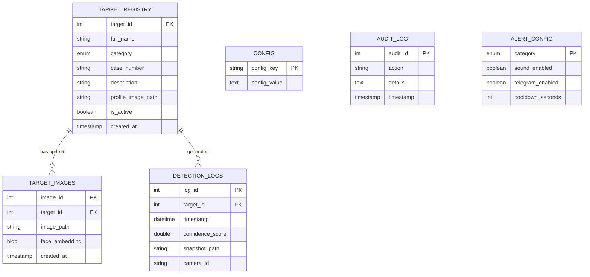
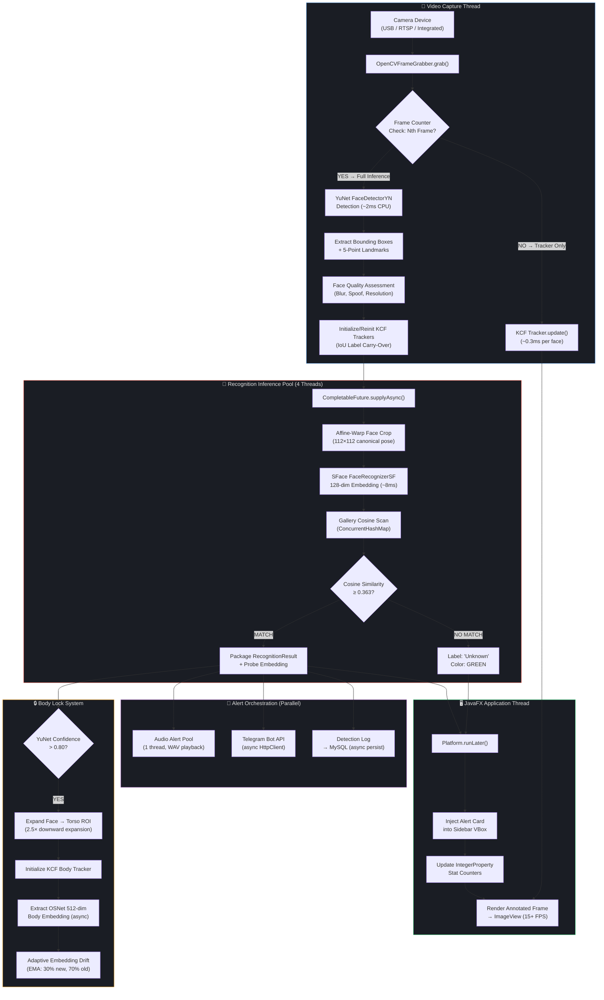
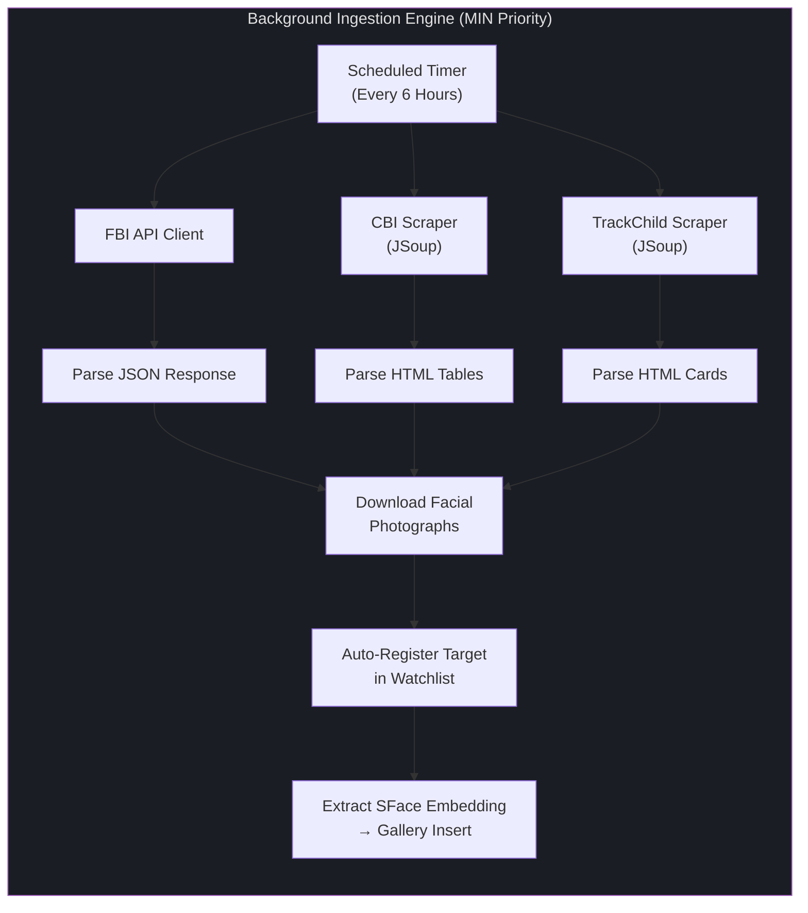

# DrishtiX v3.0 — Project Synopsis

### Real-Time Edge AI Facial Recognition & Alert System for Law Enforcement and Civic Security

---

## 1. Executive Summary & Vision

### 1.1 The Passive Surveillance Crisis

The global deployment of over one billion CCTV cameras represents one of the largest capital investments in public safety infrastructure. Yet the operational return on this investment remains critically undermined by a single architectural flaw: **traditional CCTV infrastructure produces passive video, not actionable intelligence**. In the prevailing "record and review" paradigm, the interpretive burden — determining whether a wanted criminal, a missing child, or an absconding suspect has appeared in the camera's field of view — is delegated entirely to human operators. A single operator is expected to monitor 16–64 multiplexed feeds, mentally cross-referencing each face against printed FIR photographs pinned to a corkboard. Decades of human factors research confirm that sustained vigilance in monotonous visual monitoring tasks degrades below **50% accuracy within the first 20 minutes** of a shift (the *vigilance decrement* effect).

The operational latency of this workflow is measured not in milliseconds, but in **hours to days**. A wanted criminal can traverse a surveilled corridor, board public transport, and vanish entirely — and the alert, if it ever materializes, arrives only during post-incident forensic review.

### 1.2 The DrishtiX v3.0 Paradigm Shift

DrishtiX v3.0 is engineered to collapse this entire surveillance latency loop into a single, deterministic pipeline that executes in **under 200 milliseconds** — faster than the human blink reflex (300–400 ms). It transitions surveillance from the passive "record and review" paradigm to a **proactive "detect and alert" edge-computing model**, where every face entering the camera's field of view is automatically matched against a dynamically updated watchlist and — upon positive identification — triggers a unified, non-blocking, multi-channel alert in real time.

DrishtiX operates entirely as a **local Edge AI Node** on a standard laptop. It requires zero cloud dependencies, zero internet connectivity for its core mission, and transmits zero personally identifiable information (PII) over any network. This architecture ensures strict data privacy compliance and eliminates API network latency, making the system suitable for deployment in air-gapped government facilities, field encampments, and border checkpoints.

### 1.3 Primary User Personas

| Persona | Role | Primary Workflow |
|---|---|---|
| **Registry Operator (Admin)** | Maintains the target watchlist | Registers new targets by uploading facial photographs, specifying name, category (CRIMINAL / MISSING_PERSON), case/FIR number, and description. Manages gallery lifecycle: search, filter, deactivate, and delete with confirmation dialogs. |
| **Surveillance Operator** | Monitors the live feed | Observes the 70/30 dashboard split (camera feed + alert sidebar). Adjusts detection confidence threshold via slider. Acknowledges alerts, toggles audio mute, and selects active camera sources. |
| **Investigating Officer** | Handles historical logs and evidence extraction | Reviews timestamped detection logs with snapshot evidence. Exports detection reports for court proceedings. Accesses audit trails for chain-of-custody compliance. |

### 1.4 Core Value Proposition

> **"From pixel to alert in under 200 milliseconds — with zero cloud dependency."**

DrishtiX eliminates the human vigilance bottleneck by deploying production-grade deep neural networks (YuNet + SFace) locally via the ONNX runtime. It sustains 15+ FPS on a standard laptop CPU, handles 9–10+ simultaneous faces per frame, and persists across face loss events through its proprietary **Body Lock** re-identification system (OSNet + KCF tracker fusion).

---

## 2. Technology Stack & Database Schema

### 2.1 Technology Stack

| Layer | Technology | Version | Purpose |
|---|---|---|---|
| **Frontend Framework** | JavaFX (OpenJFX) | 21.0.2+ | Hardware-accelerated desktop GUI with Prism rendering engine (Direct3D / Metal / OpenGL) |
| **Frontend Styling** | JavaFX CSS | — | Ambient Glassmorphism dark theme, Bento Grid layout, WCAG AA accessible palette |
| **Frontend Extensions** | ControlsFX | 11.2.1 | Native toast notifications, advanced interactive controls |
| **Backend Core** | Java (LTS) | 17+ | Platform language with `java.util.concurrent` for deterministic multi-threading |
| **Computer Vision Engine** | OpenCV | 4.9.0+ | DNN inference, image processing, object tracking (KCF/CSRT) |
| **CV Java Bindings** | JavaCV | 1.5.10 | Direct JNI bindings to native OpenCV C++ — no Python, no GIL |
| **Face Detection Model** | YuNet (ONNX) | 2023-Mar | Multi-target detection via `FaceDetectorYN` (~2 ms/frame CPU) |
| **Face Recognition Model** | SFace / ArcFace (ONNX) | 2021-Dec | 128-dim metric embedding extraction via `FaceRecognizerSF` |
| **Body Re-ID Model** | OSNet x0.25 (ONNX) | MSMT17 | 512-dim body appearance embedding for post-face-loss tracking |
| **Database** | MySQL | 8.0+ | Relational persistence for targets, images, detection logs, configuration |
| **Connection Pooling** | HikariCP | 5.1+ | High-performance JDBC connection pool (zero-overhead abstraction) |
| **External Alerts** | Telegram Bot API | — | Asynchronous push notifications via `java.net.http.HttpClient` |
| **HTML Scraping** | JSoup | 1.17.2 | CBI / TrackChild government portal data extraction |
| **JSON Processing** | org.json | 2024-03 | FBI API response deserialization |
| **Logging** | SLF4J + Logback | 2.0.12 / 1.5.3 | Structured diagnostic logging with millisecond timestamps |
| **Build System** | Apache Maven | 3.9+ | Multi-module build, fat JAR packaging via `maven-shade-plugin` |
| **Testing** | JUnit 5 + Mockito + TestFX | 5.10 / 5.11 / 4.0 | Unit, integration, and headless JavaFX UI testing |

### 2.2 Database Schema

The DrishtiX database is designed as a **highly relational schema** that enforces referential integrity across the surveillance data lifecycle: from target registration, through multi-photo gallery management, to timestamped detection evidence.

#### 2.2.1 Core Tables

| Table | Purpose | Key Columns | Relationships |
|---|---|---|---|
| `target_registry` | Master watchlist record | `target_id` (PK, AUTO_INCREMENT), `full_name`, `category` (ENUM: CRIMINAL, MISSING_PERSON), `case_number`, `description`, `profile_image_path`, `is_active` (BOOLEAN), `created_at` (TIMESTAMP) | Parent of `target_images`, `detection_logs` |
| `target_images` | Multi-photo gallery (up to 5 per target) | `image_id` (PK), `target_id` (FK → `target_registry`), `image_path`, `face_embedding` (BLOB, 128×FLOAT32 = 512 bytes), `created_at` | Many-to-One → `target_registry` |
| `detection_logs` | Historical detection events with evidence | `log_id` (PK), `target_id` (FK → `target_registry`), `timestamp` (DATETIME), `confidence_score` (DOUBLE), `snapshot_path`, `camera_id`, `bounding_box_coords` | Many-to-One → `target_registry` |
| `config` | Runtime configuration key-value store | `config_key` (PK, VARCHAR), `config_value` (TEXT) | Standalone |
| `audit_log` | Immutable action trail for compliance | `audit_id` (PK), `action` (VARCHAR), `details` (TEXT), `timestamp`, `user_id` | Standalone |
| `alert_config` | Per-category alert routing rules | `category` (PK, ENUM), `sound_enabled` (BOOLEAN), `telegram_enabled` (BOOLEAN), `cooldown_seconds` (INT) | Standalone |
| `camera_sources` | Registered camera devices | `camera_id` (PK), `name`, `uri`, `is_active` | Standalone |
| `counters` | Auto-increment sequence generators | `table_name` (PK), `current_seq` (BIGINT) | Standalone |

#### 2.2.2 Schema Relationship Diagram



---

## 3. System Architecture & Concurrency Model

### 3.1 The Hardware Bottleneck

DrishtiX faces a fundamental engineering constraint that separates it from cloud-hosted surveillance platforms: **all computation — frame capture, deep learning inference, gallery matching, and UI rendering — must execute concurrently on a single laptop CPU** while maintaining a perceptually smooth 15+ FPS video feed.

A naive single-threaded approach is immediately disqualified: YuNet detection (~2 ms) + face alignment (~1 ms) + SFace embedding extraction (~8 ms) + gallery cosine scan (~2 ms) = **~13 ms per face**. With 5 simultaneous faces, this totals ~65 ms, leaving only ~1.6 ms for UI rendering within a 66.7 ms frame budget (15 FPS). Any additional processing (alert card injection, stats update, audio playback) would push the pipeline beyond the frame budget, causing visible stuttering.

### 3.2 The Three-Pool Threading Architecture

DrishtiX resolves this bottleneck through a strict **Three-Pool Threading Architecture** that isolates UI rendering, video capture, and heavy inference into dedicated, non-competing execution contexts:

| Pool | Thread Count | Priority | Responsibility | Latency Budget |
|---|---|---|---|---|
| **Main UI Thread** | 1 (JavaFX Application Thread) | Normal | Scene graph mutations, `Platform.runLater()` callbacks, alert card injection, `IntegerProperty` stat counter updates | ≤ 16 ms per callback |
| **Video Capture Thread** | 1–2 (Video Inference Pool) | Normal | `OpenCVFrameGrabber.grab()`, YuNet `FaceDetectorYN` detection (~2 ms), KCF/CSRT tracker initialization and update, frame-skip decision logic | Yield frames at ≥ 15 FPS |
| **Recognition Inference Pool** | 4 (Fixed `ExecutorService`) | Normal | SFace `FaceRecognizerSF` embedding extraction via `ThreadLocal` model instances, OSNet body embedding extraction, gallery cosine similarity scan, `CompletableFuture`-based result delivery | ≤ 150 ms per face (async, non-blocking) |

**Supplementary Pools** (not part of the core three-pool contract):

| Pool | Threads | Purpose |
|---|---|---|
| **Audio Alert Pool** | 1 | `javax.sound.sampled` WAV playback — isolated to prevent blocking inference |
| **Ingestion Pool** | 2 (MIN priority) | FBI/CBI/TrackChild web scraping — low priority to avoid stealing CPU from inference |
| **Scheduled Pool** | 1 | Periodic maintenance: snapshot cleanup, configuration refresh |

### 3.3 Concurrent Pipeline Architecture Diagram



### 3.4 Thread Safety Mechanisms

| Mechanism | Location | Purpose |
|---|---|---|
| `ThreadLocal<FaceRecognizerSF>` | `DnnFaceRecognitionService` | Each of the 4 recognition threads has its own private SFace model instance, enabling lock-free parallel embedding extraction |
| `ConcurrentHashMap<Integer, TargetEmbeddings>` | In-memory Gallery | Lock-free concurrent reads during matching; write-serialized via `ReentrantReadWriteLock` |
| `Platform.runLater()` | All UI mutations | Ensures every scene graph modification executes on the JavaFX Application Thread, preventing rendering race conditions |
| `AtomicBoolean`, `AtomicLong`, `AtomicReference` | Camera state, frame counter, threshold | Lock-free primitives for cross-thread state coordination |
| `CompletableFuture` chains | Inference dispatch | Decouples heavy SFace computation from the capture thread; results delivered via `.thenAcceptAsync()` |
| `volatile` singletons | All service classes | Double-checked locking pattern ensures thread-safe lazy initialization |

---

## 4. Deep Learning Computer Vision Pipeline

### 4.1 The Legacy Pipeline: Haar Cascade + LBPH (Retained as Fallback)

DrishtiX v1.0–v2.0 employed the classical two-stage pipeline that has served as the entry point for face recognition systems since the early 2000s:

| Stage | Algorithm | Latency | Limitations |
|---|---|---|---|
| **Detection** | Viola-Jones Haar Cascade (`haarcascade_frontalface_alt2.xml`) | ~5–10 ms | Pose sensitivity (±15° only), illumination fragility, single-face bias, no landmark output |
| **Recognition** | Local Binary Pattern Histograms (LBPH) | ~20–50 ms | Holistic texture encoder (not geometric identity); mask/occlusion destroys histogram; **requires full model retrain** to add new targets |

> **Retention as Zero-Degradation Fallback**: The Haar+LBPH pipeline is preserved in v3.0 as a configuration-switchable fallback (`face_detection_method = "HAAR"`) for deployment on legacy field hardware that lacks ONNX model execution support.

### 4.2 The DNN Pipeline: YuNet + SFace (Primary)

The v3.0 architecture replaces the legacy pipeline with production-grade deep neural network models in the **ONNX (Open Neural Network Exchange)** format, executed via OpenCV's built-in DNN module.

#### 4.2.1 Face Detection: FaceDetectorYN (YuNet)

**Model File**: `face_detection_yunet_2023mar.onnx`

YuNet is a lightweight convolutional neural network employing a **Feature Pyramid Network (FPN)** backbone that processes frames at multiple spatial scales simultaneously. This enables detection of faces ranging from 80×80 pixels (distant subjects in a corridor) to full-frame close-ups.

| Metric | Haar Cascade | MTCNN | RetinaFace | **YuNet** |
|---|---|---|---|---|
| Inference Latency (CPU) | 5–10 ms | 40–80 ms | 60–120 ms | **~2 ms** |
| Multi-Face (10+) | Poor | Good | Excellent | **Excellent** |
| Pose Tolerance | ±15° | ±30° | ±45° | **±45°** |
| 5-Point Landmarks | ❌ | ✅ | ✅ | **✅** |
| ONNX Native | N/A | Partial | Partial | **✅** |
| Thermal Sustainability | ✅ | ❌ (GPU) | ❌ (GPU) | **✅ (CPU)** |

**Output per Detection**:
1. Bounding box `(x, y, width, height)`
2. Detection confidence score (0.0–1.0)
3. Five facial landmarks: left eye, right eye, nose tip, left mouth corner, right mouth corner

The 5-point landmarks are indispensable for the downstream **face alignment** step.

#### 4.2.2 Face Recognition: FaceRecognizerSF (SFace / ArcFace)

**Model File**: `face_recognition_sface_2021dec.onnx`

SFace is a deep metric-learning model based on the ShuffleNet backbone, trained with an ArcFace-variant angular margin loss function. The recognition pipeline proceeds in three stages:

**Stage 1 — Affine Face Alignment**: The 5-point landmarks from YuNet are used to compute an affine transformation matrix that geometrically warps the detected face crop into a **canonical 112×112 frontal pose**. This normalization ensures that the same person at different head poses produces geometrically consistent inputs to the embedding network.

**Stage 2 — Embedding Extraction**: The aligned 112×112 face is forward-passed through the SFace network, producing a **128-dimensional L2-normalized float vector** (embedding). This vector encodes facial identity as a geometric direction in high-dimensional space, not as raw pixel similarity.

**Stage 3 — Gallery Matching**: The probe embedding is compared against every gallery embedding via **cosine similarity** (equivalent to dot product for unit vectors). The published operational threshold is **0.363** — any match exceeding this value constitutes a positive identification.

| Aspect | LBPH (Legacy) | SFace (v3.0) |
|---|---|---|
| Representation | Texture histogram | 128-dim float vector |
| Matching | Chi-squared distance | Cosine similarity |
| Adding New Target | **Full model retrain** | **Store one vector (O(1))** |
| Occlusion Handling | Catastrophic failure | Geometry-resilient (masks, glasses) |
| Gallery Scalability | O(n) retrain cost | O(1) insert, O(n) scan |

#### 4.2.3 Occlusion Resistance

Because SFace encodes identity as **geometric spatial relationships between facial landmarks** rather than holistic texture, it provides inherent resistance to partial occlusion. Surgical masks covering the lower face preserve the critical eye-nose triangle geometry; sunglasses occluding the eyes still leave the nose-mouth-jawline geometry intact. This is a fundamental architectural advantage over texture-based methods (LBPH, Eigenfaces) where any occlusion destroys the statistical distribution.

#### 4.2.4 Face Quality Assessment (FQA) Gate

Before dispatching a face crop to the recognition pool, DrishtiX performs a multi-criteria quality assessment on the capture thread:

| Gate | Criterion | Threshold | Purpose |
|---|---|---|---|
| **Resolution** | Face width × height | ≥ 48×48 px | Reject faces too small for reliable embedding |
| **Blur** | Laplacian variance | ≥ 80.0 | Reject motion-blurred faces |
| **Spoof** | Texture analysis | Configurable | Reject printed photos, screen replays |
| **Dynamic Threshold** | Base + size penalty + blur penalty | ≤ 0.95 max | Tighten matching threshold for low-quality inputs |

---

## 5. Frontend & UI/UX Architecture

### 5.1 The Dashboard-Centric Unified Screen Philosophy

DrishtiX's UI is designed around a single, non-navigating **dashboard screen** where the operator never loses sight of the live camera feed. The layout follows a **70/30 Bento Grid split**:

```
┌─────────────────────────────────────┬──────────────────────┐
│              70% WIDTH              │      30% WIDTH       │
│                                     │                      │
│     LIVE SURVEILLANCE FEED          │   System Status       │
│     (Camera ImageView)              │   ┌──────┬──────┐    │
│                                     │   │Total │Today │    │
│     • YuNet bounding boxes          │   │Tgts  │Scans │    │
│     • Category-coded colors:        │   ├──────┼──────┤    │
│       🔴 RED    = Criminal          │   │Crim  │Miss  │    │
│       🔵 CYAN   = Missing Person    │   │Match │Prsns │    │
│       🟢 GREEN  = Unknown           │   └──────┴──────┘    │
│       🟠 AMBER  = Body Lock         │                      │
│                                     │   Live Alert Queue    │
├─────────────────────────────────────┤   ┌─────────────┐    │
│   Control Bar                       │   │ 🚨 Alert #1  │    │
│   ┌────────────────┐ ┌────┐ ┌────┐ │   │ [DB] [Live]  │    │
│   │ Threshold ──○──│ │Cam▾│ │STOP│ │   ├─────────────┤    │
│   └────────────────┘ └────┘ └────┘ │   │ 🔍 Alert #2  │    │
│   FPS: 15  |  🔇 Mute              │   └─────────────┘    │
└─────────────────────────────────────┤   [+ Add Target]     │
                                      └──────────────────────┘
```

### 5.2 UI Modernization: Ambient Glassmorphism Dark Mode

The visual design employs a **WCAG AA accessible dark mode** with ambient glassmorphism effects:

| Element | Color / Style | Purpose |
|---|---|---|
| **Root Background** | `#0D0F14` (near-black) | Reduces eye strain during 8-hour surveillance shifts |
| **Component Cards** | `#1A1D24` with `0.85` opacity | Bento grid tiles with subtle elevation via `box-shadow` |
| **Glassmorphism Panels** | `rgba(255,255,255,0.05)` + `backdrop-filter: blur(20px)` | Frosted glass effect on dialog overlays |
| **Bounding Box Text** | White text on dark semi-transparent background pills | Readable against both bright outdoor and dark indoor video feeds |
| **Alert Badge (Criminal)** | `#E74C3C` red pill | Immediate category recognition |
| **Alert Badge (Missing)** | `#3498DB` blue pill | Immediate category recognition |
| **Soft Drop Shadows** | `0 4px 12px rgba(0,0,0,0.6)` | Depth separation between bento tiles |
| **Interactive Hover** | 200ms ease-in-out scale transform | Micro-animation feedback on buttons and cards |

### 5.3 The Dynamic Alert Queue

The alert queue is the operator's primary intelligence delivery mechanism. It was designed to solve the **"alert fatigue"** problem caused by intrusive modal pop-ups that occlude the live video feed:

| Feature | Specification |
|---|---|
| **Container** | Scrollable `VBox` in the right 30% panel |
| **Memory Safety** | Strict **50-card cap** (`MAX_ALERT_QUEUE_SIZE = 50`). When capacity is reached, the oldest card is auto-pruned before a new card is prepended. This guarantees bounded heap consumption regardless of surveillance duration. |
| **Card Content** | Target name, category badge (red/blue pill), confidence %, case/FIR number, database photo vs. live snapshot (side-by-side verification), timestamp |
| **Cooldown** | Per-target cooldown window (default: 30 seconds) suppresses redundant alerts for the same person |
| **Injection** | All card mutations execute via `Platform.runLater()` on the JavaFX Application Thread — zero rendering race conditions |
| **Pruning** | Oldest card removed via `alertQueueBox.getChildren().remove(lastIndex)` before new card is prepended at index 0 |

### 5.4 FXML Declarative Layout

All views are defined in **FXML** (XML-based declarative UI), enforcing strict separation of layout structure from controller business logic:

| View | File | Controller | Content |
|---|---|---|---|
| Main Container | `main_view.fxml` | `MainController` | Navigation sidebar + content area |
| Dashboard | `dashboard_view.fxml` | `DashboardController` | Camera feed, stats, control bar, alert queue |
| Registry | `registry_view.fxml` | `RegistryController` | Target table, search, filter, CRUD dialogs |

---

## 6. Automated Background Intelligence Sync

### 6.1 The Background Ingestion Engine

DrishtiX v3.0 includes a **Scheduled Background Synchronization Engine** that automatically populates the local watchlist from authoritative external law enforcement databases. This engine operates on a dedicated **2-thread, MIN-priority scheduled executor pool** (`DrishtiX-Ingestion`), ensuring that web scraping and API polling never steal CPU cycles from the time-critical inference pipeline.

### 6.2 Data Sources

| Source | Client Class | Protocol | Data Extracted | Rate Limit |
|---|---|---|---|---|
| **FBI Most Wanted** | `FbiWantedApiClient` | REST/JSON (`api.fbi.gov/wanted/v1/list`) | Name, aliases, case number, facial photographs, reward information | 2-second delay between paginated requests |
| **CBI Wanted List** | `CbiWantedScraper` | HTML scraping via JSoup (`cbi.gov.in`) | Name, case details, photographs, jurisdiction | 2-second delay between page loads |
| **TrackChild Portal** | `TrackChildScraper` | HTML scraping via JSoup (`trackthemissingchild.gov.in`) | Missing child name, age, physical description, photographs | 2-second delay between requests |

### 6.3 Anti-DDoS & Operational Safeguards

| Safeguard | Implementation |
|---|---|
| **Rate Limiting** | Strict 2-second `Thread.sleep()` between consecutive HTTP requests to prevent IP blacklisting |
| **Startup Delay** | 60-second delay after application launch before the first ingestion cycle, allowing the inference pipeline to stabilize |
| **Configurable Interval** | Default: every 6 hours (`ingestion_interval_hours` in config). Adjustable without restart |
| **Failure Isolation** | Each source client runs independently; a failure in FBI ingestion does not block CBI or TrackChild |
| **Graceful Shutdown** | `BackgroundIngestionEngine.stop()` called during `DrishtiXApp.shutdown()` — ensures clean thread termination |
| **MIN Thread Priority** | Ingestion threads run at `Thread.MIN_PRIORITY`, yielding CPU to inference and UI threads under contention |

### 6.4 Ingestion Pipeline Flow



---

## 7. Non-Functional Requirements

### 7.1 NFR Specification Table

| NFR ID | Category | Requirement | Target Metric | Justification |
|---|---|---|---|---|
| NFR-01 | **Latency** | Video feed capture to annotated display | **≤ 100 ms** | Perceptually instantaneous; faster than human saccadic eye movement (~150 ms) |
| NFR-02 | **Inference** | Total DNN pipeline per frame (detection + alignment + recognition + gallery match) | **≤ 150 ms** | Runs on dedicated 4-thread recognition pool; never blocks the UI |
| NFR-03 | **End-to-End** | Frame capture → alert delivery (sidebar + audio + Telegram) | **≤ 200 ms** | Faster than the human blink reflex (300–400 ms) |
| NFR-04 | **Frame Rate** | Live camera feed rendering rate | **≥ 15 FPS** | Minimum for perceptually smooth video; 30 FPS preferred |
| NFR-05 | **Uptime** | Continuous unattended operation | **99.5% over 8-hour shifts** | Enforced by `Mat.release()` native memory cleanup, bounded alert queue, daemon threads |
| NFR-06 | **Memory (UI DOM)** | Maximum alert cards in sidebar | **50 cards (strict cap)** | Auto-prune oldest → prevents unbounded JavaFX scene graph growth and JVM heap exhaustion |
| NFR-07 | **Memory (JVM)** | Peak heap usage during operation | **≤ 512 MB** | Configured via `-Xmx512m`; native OpenCV memory managed separately via explicit `Mat.release()` |
| NFR-08 | **Scalability** | Watchlist gallery capacity | **10,000+ profiles** | In-memory `ConcurrentHashMap` gallery with O(n) linear scan; pre-computed centroid embeddings for fast matching |
| NFR-09 | **Privacy** | Data locality | **100% on-device** | Zero cloud dependency — no frames, embeddings, or PII leave the machine |
| NFR-10 | **Thermal** | Sustained CPU utilization | **≤ 60%** | Frame-skipping (inference every 2nd frame) + KCF trackers (~0.3 ms) for intermediate frames |
| NFR-11 | **Resilience** | Graceful degradation when DB is unavailable | **Hardcoded defaults** | `ConfigurationService.loadDefaults()` provides fallback values for all configuration keys |
| NFR-12 | **Detection** | Simultaneous face detection capacity | **9–10+ faces per frame** | YuNet FPN multi-scale architecture handles crowded scenes |
| NFR-13 | **Body Lock** | Post-face-loss persistent tracking duration | **Up to 120 seconds** | KCF tracker (~0.3 ms constant) + OSNet adaptive embedding drift + configurable `BODY_LOCK_MAX_FRAMES = 1800` |
| NFR-14 | **Alert Cooldown** | Minimum interval between duplicate alerts for same target | **30 seconds (configurable)** | Prevents alert fatigue from continuous re-detections |

---

*Document generated by the DrishtiX v3.0 Engineering Team. Classification: INTERNAL — LAW ENFORCEMENT SENSITIVE.*
