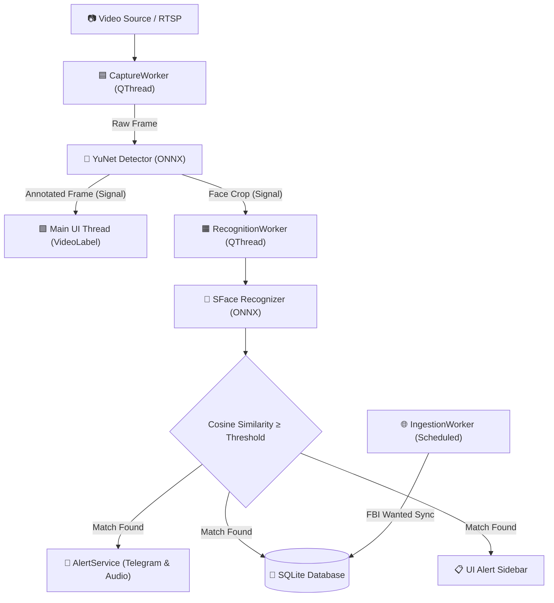

# DrishtiX Python Service (`drishtix-py`)

**Next-Generation Edge-AI Facial Recognition & Tactical Surveillance Engine**

`drishtix-py` is the modernized Python-centric core of the DrishtiX ecosystem. Built on **PySide6 (Qt6)**, **OpenCV DNN**, **ONNX**, and **SQLAlchemy**, it delivers real-time face detection, 128-dimensional facial embedding recognition, asynchronous multi-channel alerting, and background target ingestion with sub-second response times.

---

## 🏛️ Architecture Overview

The Python architecture is organized into clean, decoupled layers following a reactive producer-consumer model:

```text
drishtix-py/
├── assets/                 # Static assets (alert sounds, icons)
│   └── sounds/             # WAV notification audio files
├── config.yaml             # Core configuration (cameras, thresholds, alerts)
├── drishtix/               # Python source package
│   ├── core/               # Configuration loader, constants, enums, Qt signals bus
│   ├── dao/                # SQLAlchemy session manager & Data Access Objects
│   ├── models/             # Declarative ORM schemas (Targets, Logs, Cameras, Config)
│   ├── services/           # Business logic (Detection, Recognition, Ingestion, Telegram)
│   ├── ui/                 # PySide6 desktop GUI (Views, custom widgets, QSS stylesheet)
│   │   ├── styles/         # Glassmorphism dark theme QSS
│   │   ├── views/          # Dashboard, Registry, Logs, Analytics, Static Scan, Settings
│   │   └── widgets/        # VideoLabel, AlertCard, AlertSidebar, ChartWidget, StatusBar
│   ├── utils/              # Vector math, model downloader, audio player, image utilities
│   └── workers/            # QThread workers (CaptureWorker, RecognitionWorker, IngestionWorker)
├── main.py                 # Application entry point
├── models/                 # Pretrained ONNX weights (YuNet detector & SFace recognizer)
├── pyproject.toml          # PEP 517/518 build definition & tool configurations
├── requirements.txt        # Production & development dependencies
└── tests/                  # Pytest test suite (DAO, Analytics, Vector Math)
```

---

## ⚡ Concurrency & Threading Model

To ensure a smooth 30+ FPS video pipeline with zero UI stutter, `drishtix-py` employs dedicated background `QThread` workers communicating via Qt's thread-safe signal/slot mechanism (`AppSignals`):

1. **Main UI Thread (`PySide6`):** Manages window rendering, user interactions, and visual telemetry updates.
2. **Video Capture Worker (`CaptureWorker`):** Runs independently to grab raw camera frames, executes real-time YuNet face detection (~2ms), crops aligned face regions, and emits frames to the UI.
3. **AI Recognition Worker (`RecognitionWorker`):** Receives detected face crops, computes 128-d SFace embeddings, matches them against the in-memory gallery cache via vector cosine similarity, and triggers alerts on positive match.
4. **Ingestion Worker (`IngestionWorker`):** Runs scheduled background syncs with external databases (such as the FBI Wanted API) without consuming inference resources.
5. **Alert Daemon (`AlertService`):** Dispatches asynchronous audio alarms and Telegram bot notifications with forensic snapshot attachments.



---

## 🛠️ Module Breakdown

| Module | Location | Description |
|---|---|---|
| **Entry Point** | [`main.py`](file:///d:/TY-IT/Enterprise_Java/Java_project/services/drishtix-py/main.py) | Bootstraps configuration, models, database session, and GUI window. |
| **Signals Bus** | [`drishtix/core/signals.py`](file:///d:/TY-IT/Enterprise_Java/Java_project/services/drishtix-py/drishtix/core/signals.py) | Central `AppSignals` instance for thread-safe cross-worker messaging. |
| **Data Access** | [`drishtix/dao/`](file:///d:/TY-IT/Enterprise_Java/Java_project/services/drishtix-py/drishtix/dao) | High-performance ORM queries for targets, face embeddings, logs, and cameras. |
| **ORM Schemas** | [`drishtix/models/`](file:///d:/TY-IT/Enterprise_Java/Java_project/services/drishtix-py/drishtix/models) | SQLAlchemy tables (`Target`, `TargetImage`, `FaceEmbedding`, `DetectionLog`, `CameraSource`, `AuditLog`). |
| **AI Inference** | [`drishtix/services/face_detection.py`](file:///d:/TY-IT/Enterprise_Java/Java_project/services/drishtix-py/drishtix/services/face_detection.py)<br>[`drishtix/services/face_recognition.py`](file:///d:/TY-IT/Enterprise_Java/Java_project/services/drishtix-py/drishtix/services/face_recognition.py) | OpenCV YuNet and SFace model wrappers with confidence score filtering. |
| **Gallery Manager** | [`drishtix/services/gallery_manager.py`](file:///d:/TY-IT/Enterprise_Java/Java_project/services/drishtix-py/drishtix/services/gallery_manager.py) | In-memory normalized embedding cache for O(1) gallery search. |
| **Alert Orchestration** | [`drishtix/services/alert_service.py`](file:///d:/TY-IT/Enterprise_Java/Java_project/services/drishtix-py/drishtix/services/alert_service.py)<br>[`drishtix/services/telegram_service.py`](file:///d:/TY-IT/Enterprise_Java/Java_project/services/drishtix-py/drishtix/services/telegram_service.py) | Multi-channel alert router with cooldown timers and Telegram photo dispatch. |
| **User Interface** | [`drishtix/ui/`](file:///d:/TY-IT/Enterprise_Java/Java_project/services/drishtix-py/drishtix/ui) | Full-featured PySide6 dark UI with responsive views, charts, and alert cards. |
| **Workers** | [`drishtix/workers/`](file:///d:/TY-IT/Enterprise_Java/Java_project/services/drishtix-py/drishtix/workers) | Asynchronous thread workers for camera capture, recognition, and API ingestion. |
| **Vector Math** | [`drishtix/utils/vector_math.py`](file:///d:/TY-IT/Enterprise_Java/Java_project/services/drishtix-py/drishtix/utils/vector_math.py) | Vector cosine similarity and Euclidean distance math operations. |

---

## 🚀 Quickstart Guide

### Prerequisites
- Python 3.11+ (Python 3.11 – 3.14 supported)
- USB Webcam or RTSP IP Camera Stream

### Installation
```bash
# Navigate to the Python service directory
cd services/drishtix-py

# Create and activate virtual environment
python -m venv venv
# On Windows:
venv\Scripts\activate
# On Linux/macOS:
source venv/bin/activate

# Install dependencies
pip install -r requirements.txt
```

### Configuration
Edit `config.yaml` to adjust camera index, thresholds, or alert credentials:
```yaml
camera:
  device_index: 0
  fps: 30
  width: 640
  height: 480

ai:
  detector_score_threshold: 0.6
  recognizer_cosine_threshold: 0.363
  nms_threshold: 0.3

alerts:
  sound_enabled: true
  telegram_enabled: false
  telegram_bot_token: ""
  telegram_chat_id: ""
```

### Running the Application
```bash
# From workspace root
start_drishtix_py.bat

# Or directly with Python
python services/drishtix-py/main.py
```

### Running Tests
```bash
# Run the automated pytest suite
pytest services/drishtix-py/tests -v
```
